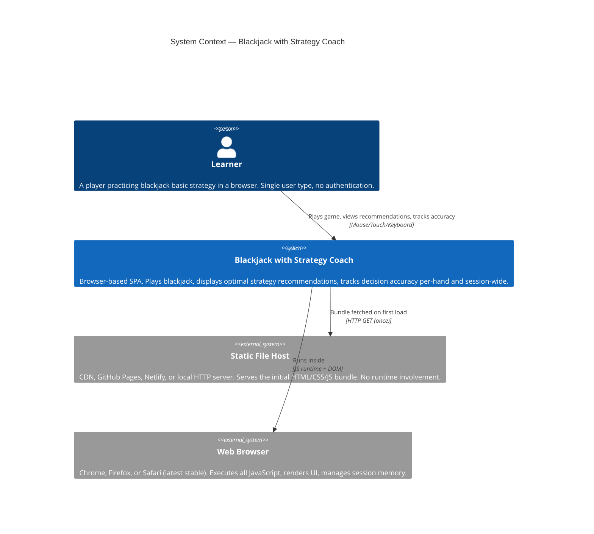
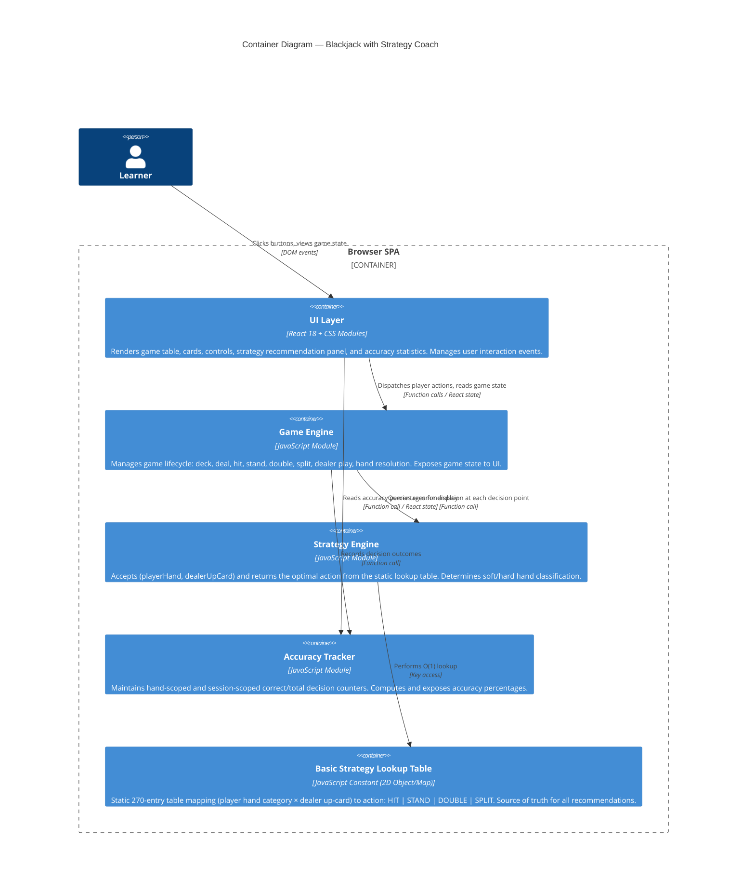
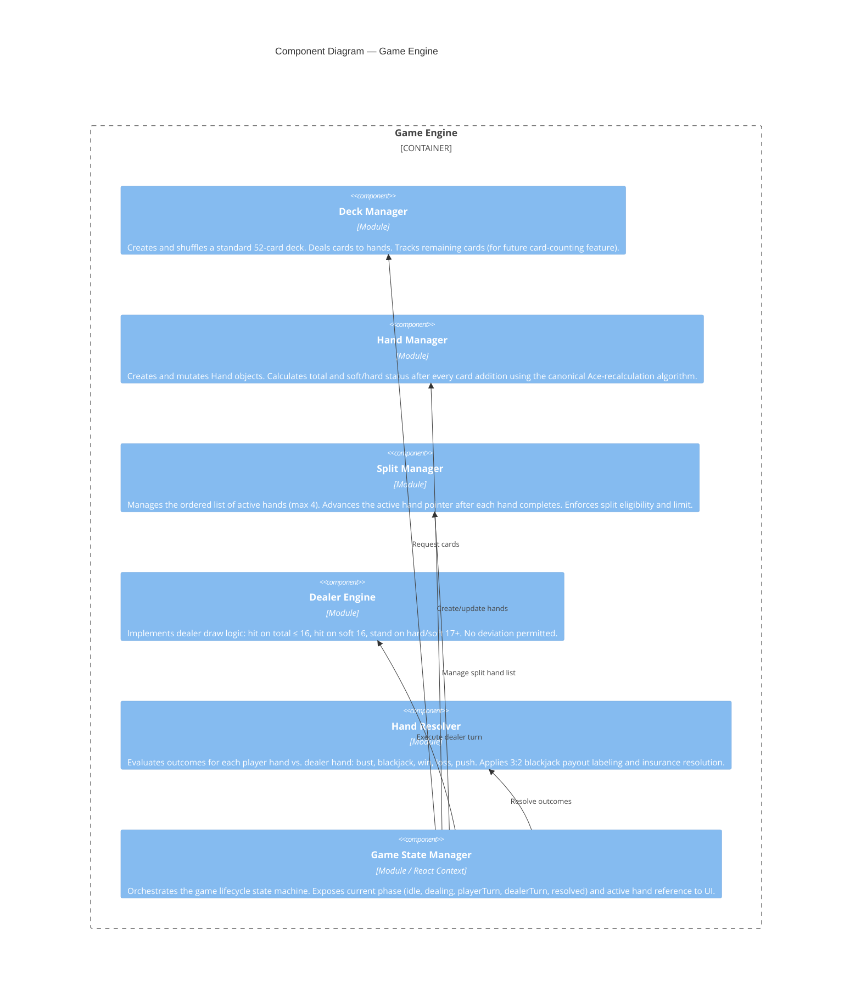
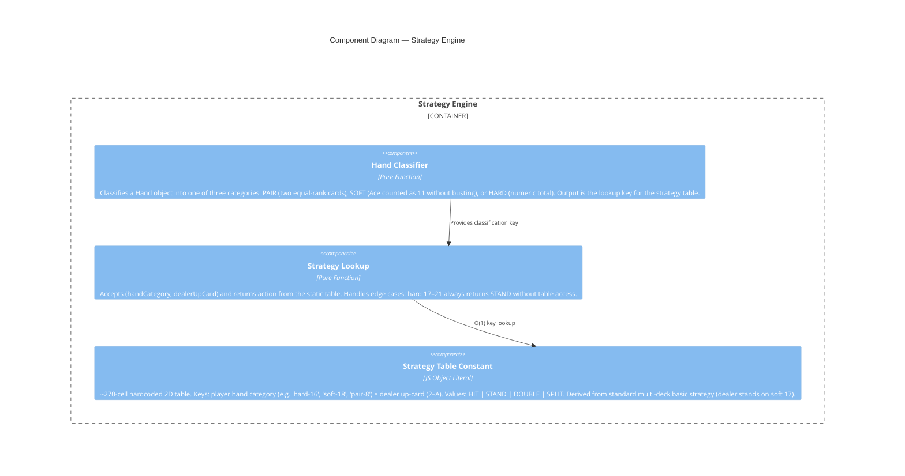
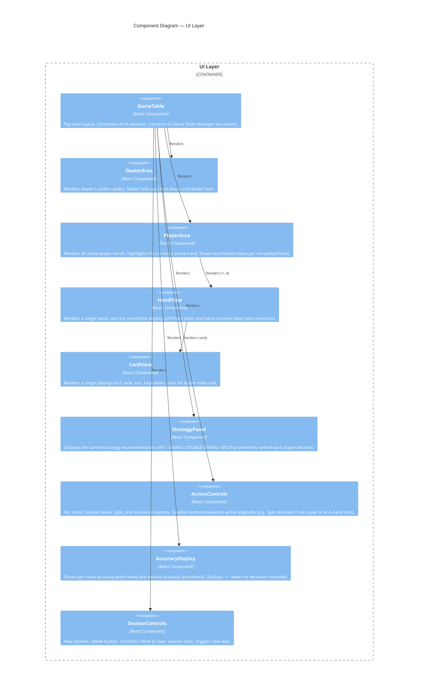
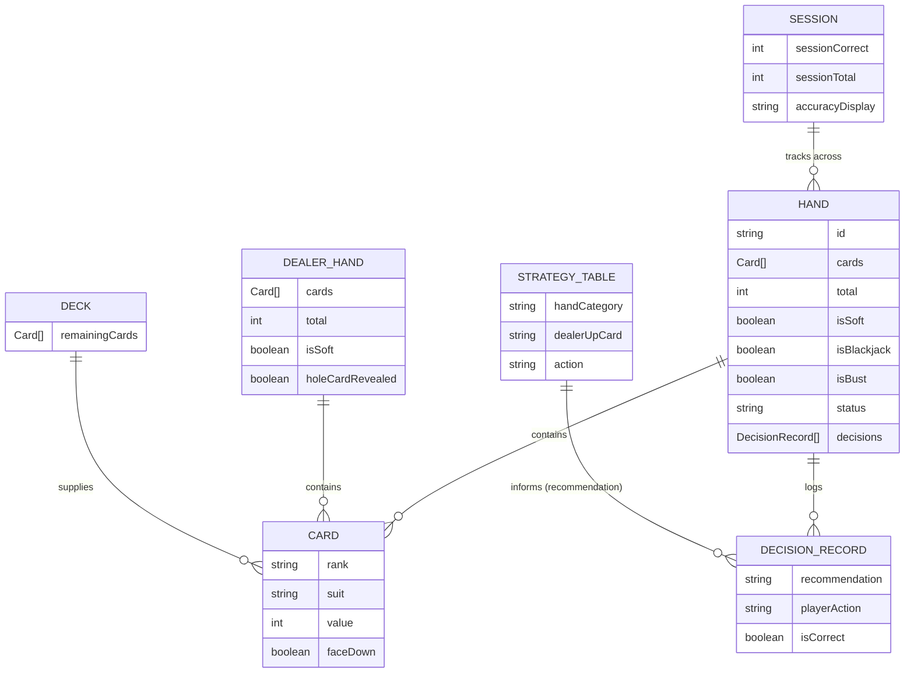
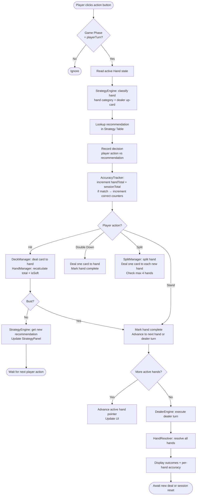
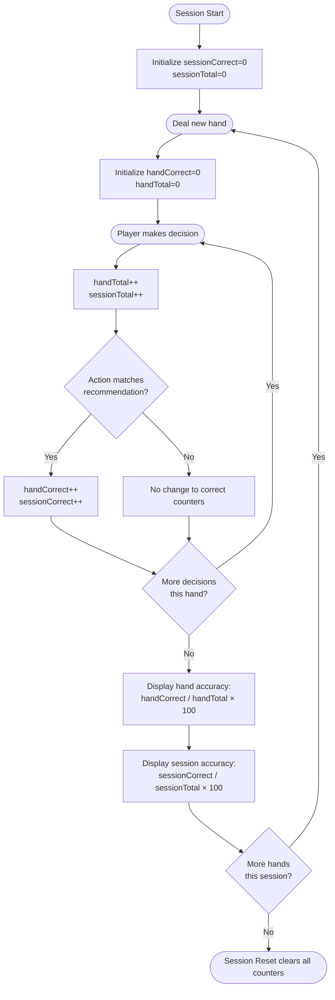

# Blackjack with Strategy Coach — Architecture Document (Solution Design Document)

**Version:** 1.0  
**Date:** 2026-07-20  
**Author:** Architecture (AI-generated, Claude Sonnet 4.6)  
**Status:** Draft  
**Based On:** Blackjack with Strategy Coach PRD v1.0

---

## Table of Contents

1. [High-Level Architecture](#1-high-level-architecture)
2. [System Context Map](#2-system-context-map)
3. [System Breakdown — C4 Modeling](#3-system-breakdown--c4-modeling)
   - 3.1 [Context Diagram](#31-context-diagram)
   - 3.2 [Container Diagram](#32-container-diagram)
   - 3.3 [Component Diagrams](#33-component-diagrams)
4. [Conceptual DB Design](#4-conceptual-db-design)
   - 4.1 [Entity-Relationship Diagram](#41-entity-relationship-diagram)
   - 4.2 [Data Flow Diagrams](#42-data-flow-diagrams)
5. [Integrations](#5-integrations)
6. [Security Considerations](#6-security-considerations)
7. [Quality Attributes (*-bilities)](#7-quality-attributes--bilities)
8. [Architectural Decision Records (ADRs)](#8-architectural-decision-records-adrs)

---

## 1. High-Level Architecture

Blackjack with Strategy Coach is a **fully client-side, single-page application (SPA)** with zero server-side components. All game logic, strategy lookups, and accuracy tracking run in the browser using React. There is no network dependency at runtime beyond initial asset delivery.

The system is structured into three logical tiers within the browser:

| Tier | Responsibility |
|------|----------------|
| **Presentation Layer** | React components rendering the game UI, cards, strategy recommendation, and accuracy stats |
| **Application / Game Logic Layer** | Pure JavaScript modules: game engine, strategy engine, accuracy tracker |
| **Data Layer** | In-memory JavaScript state (React state + context); static lookup table encoded as a constant |

```
┌─────────────────────────────────────────────────────┐
│                     Browser                          │
│  ┌──────────────────────────────────────────────┐   │
│  │           React SPA (Vite bundle)            │   │
│  │  ┌────────────────┐  ┌────────────────────┐  │   │
│  │  │  UI Components │  │   Game Engine      │  │   │
│  │  │  (Presentation)│◄─┤  (App Logic)       │  │   │
│  │  └────────────────┘  ├────────────────────┤  │   │
│  │                      │  Strategy Engine   │  │   │
│  │                      ├────────────────────┤  │   │
│  │                      │  Accuracy Tracker  │  │   │
│  │                      ├────────────────────┤  │   │
│  │                      │  Static Strategy   │  │   │
│  │                      │  Lookup Table      │  │   │
│  │                      └────────────────────┘  │   │
│  └──────────────────────────────────────────────┘   │
└─────────────────────────────────────────────────────┘
         ▲ HTML/CSS/JS served once from
         │ static file host (CDN or local)
```

**Deployment model:** Static file hosting only. A CDN, GitHub Pages, Netlify, or any HTTP file server suffices. No API gateway, no database, no authentication service.

---

## 2. System Context Map

The Blackjack application operates as a self-contained system. External actors and systems are minimal.



**Bounded Context:** There is a single bounded context — the **Game Session** — which encompasses the entire application. No domain partitioning across services is required for V1.

---

## 3. System Breakdown — C4 Modeling

### 3.1 Context Diagram

_(Covered in Section 2 above.)_

---

### 3.2 Container Diagram

The application is a single deployable container: a static web bundle. Internally, three logical containers can be identified (all in-process in the browser).



---

### 3.3 Component Diagrams

#### 3.3.1 Game Engine — Components



#### 3.3.2 Strategy Engine — Components



#### 3.3.3 UI Layer — Components



---

## 4. Conceptual DB Design

This application has **no persistent database**. All state is in-memory JavaScript within the browser session. Page refresh clears all state (acceptable per PRD).

The conceptual data model below represents the in-memory object model — the runtime state structures the application manages.

### 4.1 Entity-Relationship Diagram



### 4.2 Data Flow Diagrams

#### DFD: Player Decision Flow



#### DFD: Strategy Recommendation Lookup

```mermaid
flowchart LR
    A([Hand + Dealer Up-Card]) --> B[HandClassifier]
    B --> C{Hand Type?}
    C -- Two equal-rank cards --> D[key = 'pair-{rank}']
    C -- Has Ace counted as 11 --> E[key = 'soft-{total}']
    C -- No soft Ace --> F[key = 'hard-{total}']
    D --> G[StrategyTable lookup\nrow: key, col: dealerUpCard]
    E --> G
    F --> G
    G --> H([Return: HIT | STAND | DOUBLE | SPLIT])
```

#### DFD: Session Accuracy Tracking



---

## 5. Integrations

### API Interface Overview

This application has **no external API integrations**. All logic is self-contained in the client bundle. There are no:
- REST or GraphQL calls
- WebSocket connections
- Third-party analytics services (V1)
- Authentication providers

The only "interface" is the browser DOM API and standard Web APIs (no localStorage required; sessionStorage is an optional enhancement for session persistence within the tab).

### Internal Module Interfaces

While not external APIs, the module boundaries are the critical interfaces for the system. These should be treated as formal contracts:

#### Strategy Engine Interface

```typescript
// Conceptual TypeScript interface (implementation in JS)

type Action = 'HIT' | 'STAND' | 'DOUBLE' | 'SPLIT';
type DealerUpCard = '2' | '3' | '4' | '5' | '6' | '7' | '8' | '9' | '10' | 'A';

interface Hand {
  cards: Card[];
  total: number;
  isSoft: boolean;
}

function getRecommendation(hand: Hand, dealerUpCard: DealerUpCard): Action
```

#### Game State — Exposed to UI

```typescript
interface GameState {
  phase: 'idle' | 'dealing' | 'insurance' | 'playerTurn' | 'dealerTurn' | 'resolved';
  playerHands: Hand[];
  activeHandIndex: number;
  dealerHand: DealerHand;
  currentRecommendation: Action | null;
  handAccuracy: number | null;        // null until hand resolves
  sessionAccuracy: number | null;     // null until first decision
  sessionCorrect: number;
  sessionTotal: number;
}
```

#### Accuracy Tracker Interface

```typescript
function recordDecision(recommendation: Action, playerAction: Action): void
function getHandAccuracy(): number | null      // null if no decisions yet
function getSessionAccuracy(): number | null   // null if no decisions yet
function resetHandCounters(): void
function resetSessionCounters(): void
```

### Integration Pattern for External Systems

No external systems are integrated in V1. If future versions introduce external systems (e.g., analytics, leaderboard API), the recommended pattern is:

- **Adapter Pattern**: Wrap external calls in a dedicated service module so game logic remains decoupled from integration details.
- **Observer/Event Pattern**: Game engine emits domain events (e.g., `handResolved`, `decisionMade`); adapters subscribe and forward to external systems without coupling the core engine.

---

## 6. Security Considerations

Given the fully client-side, no-backend, no-authentication architecture, the attack surface is minimal. Nonetheless, the following considerations apply:

| Concern | Risk Level | Mitigation |
|---------|------------|------------|
| **XSS (Cross-Site Scripting)** | Low | React's JSX escapes output by default. No `dangerouslySetInnerHTML` should be used. No user-generated content is rendered. |
| **Dependency Supply Chain** | Medium | Dependencies (React, Vite, Vitest, Playwright) must be pinned to known versions. `npm audit` must be run and pass before release. |
| **Content Security Policy (CSP)** | Low-Medium | The static host should serve a strict CSP header: `default-src 'self'`, no inline scripts, no eval. Vite's build output supports this. |
| **No Sensitive Data Exposure** | N/A | No user credentials, PII, or financial data. Session accuracy data exists only in-memory; no storage, no transmission. |
| **Third-Party Script Injection** | N/A (V1) | No third-party scripts are loaded in V1. If analytics are added later, use Subresource Integrity (SRI) hashes. |
| **localStorage / sessionStorage** | N/A (V1) | No storage APIs are used. If added in future versions, do not store any data that could be considered sensitive. |

---

## 7. Quality Attributes (*-bilities)

### 7.1 Operational

| Quality | NFR Ref | Architectural Approach |
|---------|---------|------------------------|
| **Performance** | NFR-7 (≤300ms response) | Pure in-memory state, no async operations, O(1) strategy lookup, React's virtual DOM diffing. No I/O bottlenecks possible in this architecture. |
| **Reliability** | NFR-1, NFR-2, NFR-3, NFR-4 | Critical logic (strategy table, hand calculator, dealer engine) isolated in pure functions with no side effects. Tested exhaustively with Vitest. Bugs cannot be introduced by UI refactors. |
| **Scalability** | N/A (V1) | No backend to scale. Static assets served via CDN. Handles unlimited concurrent users at zero marginal cost. |
| **Security** | See Section 6 | Minimal attack surface; React escaping; CSP headers; dependency auditing. |

### 7.2 Development

| Quality | Architectural Approach |
|---------|------------------------|
| **Maintainability** | Separation of concerns: game logic modules are framework-agnostic pure functions. UI components are thin wrappers over state. Strategy table is a single, testable constant — easy to audit against reference charts. |
| **Extensibility** | Out-of-scope features (card counting, configurable rules, EV display) can be added without modifying core modules. Card counting adds to DeckManager. Configurable rules parameterize StrategyEngine and DealerEngine without restructuring. |
| **Testability** | Pure functions with no side effects make unit testing straightforward. Vitest for logic units; React Testing Library for component behavior; Playwright for E2E cross-browser flows. NFR-1 requires ~270 unit test cells for the strategy table alone. |
| **Deployability** | Vite produces a static bundle (`dist/`) deployable to any CDN or file server. No environment variables, no secrets, no build-time configuration beyond standard Vite defaults. |
| **Portability** | Standard HTML5/CSS3/JS with React. Runs on any modern browser (Chrome, Firefox, Safari). No native dependencies, no OS-specific code. |

### 7.3 System

| Quality | Architectural Approach |
|---------|------------------------|
| **Modularity** | Five discrete modules (Game Engine, Strategy Engine, Accuracy Tracker, Strategy Table, UI Layer) with explicit interfaces. Modules may be tested and replaced independently. The Strategy Table is a data constant, not behavior — it can be replaced with a different variant (e.g., single-deck rules) without changing any logic. |
| **Responsiveness** | CSS3 responsive layout (CSS Grid/Flexbox) ensures the application renders correctly from 320px to 1920px (NFR-6). Breakpoints at 375px, 768px, 1024px. ActionControls layout adapts for narrow viewports. |

---

## 8. Architectural Decision Records (ADRs)

### ADR-001: Fully Client-Side Architecture (No Backend)

**Status:** Accepted  
**Context:** PRD explicitly states no server-side component is required. All game logic is deterministic and runs from a known static state. No user accounts or cross-session persistence.  
**Decision:** Deploy as a static SPA with zero backend infrastructure.  
**Consequences:** Simplest possible deployment; no operational burden. Session data is lost on page refresh (acceptable per PRD). No server-side validation is possible (not needed — no money, no multi-player).

---

### ADR-002: React for UI Layer

**Status:** Accepted  
**Context:** Tech stack mandates React for dynamic UI. Blackjack UI has significant dynamic state: up to 4 hands, per-card rendering, real-time accuracy percentages, conditional button availability.  
**Decision:** Use React 18 with functional components and hooks. Game state managed via `useReducer` + React Context to avoid prop-drilling across the component tree.  
**Consequences:** Predictable state transitions via reducer; easy to test state transitions independently of rendering.

---

### ADR-003: Strategy Table as Pure Data Constant

**Status:** Accepted  
**Context:** PRD explicitly requires the strategy table to be a 2D lookup (not a computed heuristic). It must be verifiable against a published reference chart.  
**Decision:** Implement the table as a single JavaScript object literal constant — a named export in its own module file. No function logic; pure data.  
**Trade-offs:** The table will have ~270 entries, making it verbose. This verbosity is intentional — it allows exhaustive automated comparison against a reference chart (NFR-1). Any algorithmic shortcut would make this verification impossible.

---

### ADR-004: Multi-Deck Basic Strategy Variant

**Status:** Accepted (resolves PRD Open Question #1)  
**Context:** Basic strategy tables differ slightly between single-deck and multi-deck games. The PRD Open Questions section flags this as unresolved.  
**Decision:** Implement the **standard multi-deck (4–8 deck) basic strategy table, dealer stands on soft 17 variant**. This is the most commonly used variant and the most widely published reference.  
**Consequences:** This must be documented as a code comment at the top of the strategy table constant file. Tests must validate against this specific variant's reference chart.

---

### ADR-005: Game State as a Reducer-Based State Machine

**Status:** Accepted  
**Context:** The game has well-defined phases (idle → dealing → insurance? → playerTurn → dealerTurn → resolved) with strict transition rules. Ad-hoc `useState` calls across components would make illegal state transitions possible (e.g., hitting during dealer turn).  
**Decision:** Model game state as a finite state machine implemented with `useReducer`. Each action type maps to a valid state transition. Invalid transitions are no-ops.  
**Consequences:** Eliminates an entire class of UI bugs. State transitions are unit-testable. Adds minor complexity vs. flat `useState` — justified by the number of game phases.

---

### ADR-006: Split Aces Receive One Card Only; No Re-Split Aces

**Status:** Accepted (resolves PRD Open Questions #2 and #3)  
**Context:** PRD in-scope clarifications state split Aces receive one card only. Re-split Aces behavior is unspecified.  
**Decision:** After splitting Aces, each resulting hand receives exactly one card and stands automatically. Re-splitting Aces is **not permitted** (consistent with most common casino rules and simplest implementation).  
**Consequences:** `SplitManager` must detect split-Ace hands and immediately advance to the next hand after one card is dealt, bypassing the normal player decision loop.

---

### ADR-007: Double Down After Split — Unrestricted

**Status:** Accepted (resolves PRD Open Question #2)  
**Context:** PRD states double down is allowed on split hands. The question is whether any total restriction applies.  
**Decision:** Double down after split is **unrestricted** — available on any two-card split hand (except split Aces, which receive one card only per ADR-006).  
**Consequences:** Simplest implementation; consistent with the PRD's statement that double down is "allowed" without qualification.

---

### ADR-008: Vite as Build Tool

**Status:** Accepted  
**Context:** Tech stack mandates Vite.  
**Decision:** Use Vite for development server and production bundle. PostCSS + Autoprefixer for CSS. ESLint + Prettier for code quality.  
**Consequences:** Fast HMR during development. Output is a static `dist/` directory. No server-side rendering complexity.

---

### ADR-009: Session Reset Requires Explicit UI Button

**Status:** Accepted (resolves PRD Open Question #5)  
**Context:** PRD requires a session reset capability. Open Question #5 asks whether it is an explicit button or page refresh.  
**Decision:** Provide an explicit **"New Session"** button in the UI. Place it outside the main action area (e.g., header or footer) to reduce risk of accidental activation mid-hand. No confirmation dialog required — session data has no financial value.  
**Consequences:** Satisfies US-3.2 unambiguously. Page refresh will also reset (acceptable side effect, not the primary mechanism).

---

### ADR-010: Accuracy Display When No Decisions Made

**Status:** Accepted (resolves PRD Open Question #7)  
**Context:** Open Question #7 asks what to show when `sessionTotal == 0`.  
**Decision:** Display **"—"** (em dash) for both session and hand accuracy when no decisions have been recorded. This is consistent with the PRD's own suggestion and avoids a misleading "0%" when no data exists.  
**Consequences:** `AccuracyTracker` returns `null` when totals are zero; `AccuracyDisplay` renders "—" for null values.

---

*Document generated as part of the Blackjack with Strategy Coach SDLC pipeline. Next artifact: Technical Design / Implementation Plan.*
