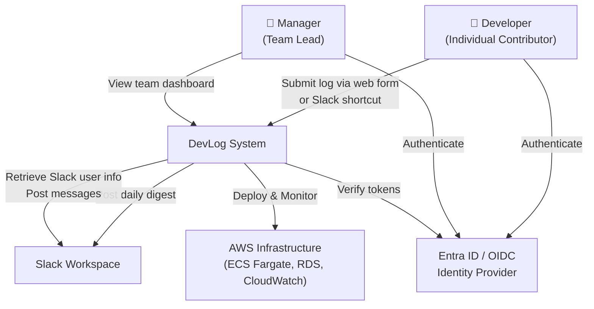
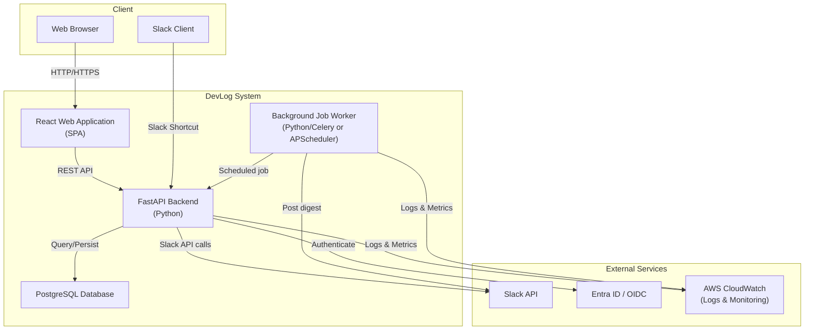
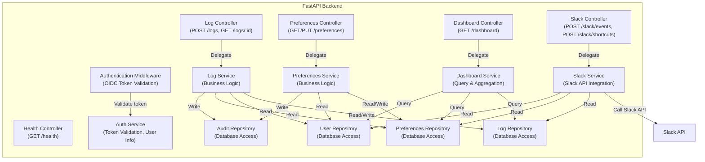
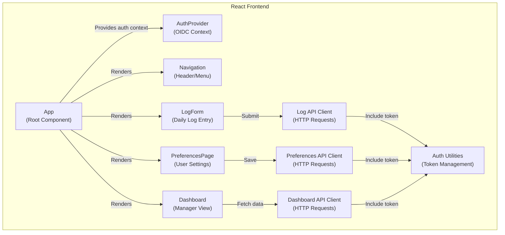
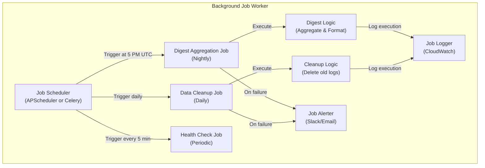
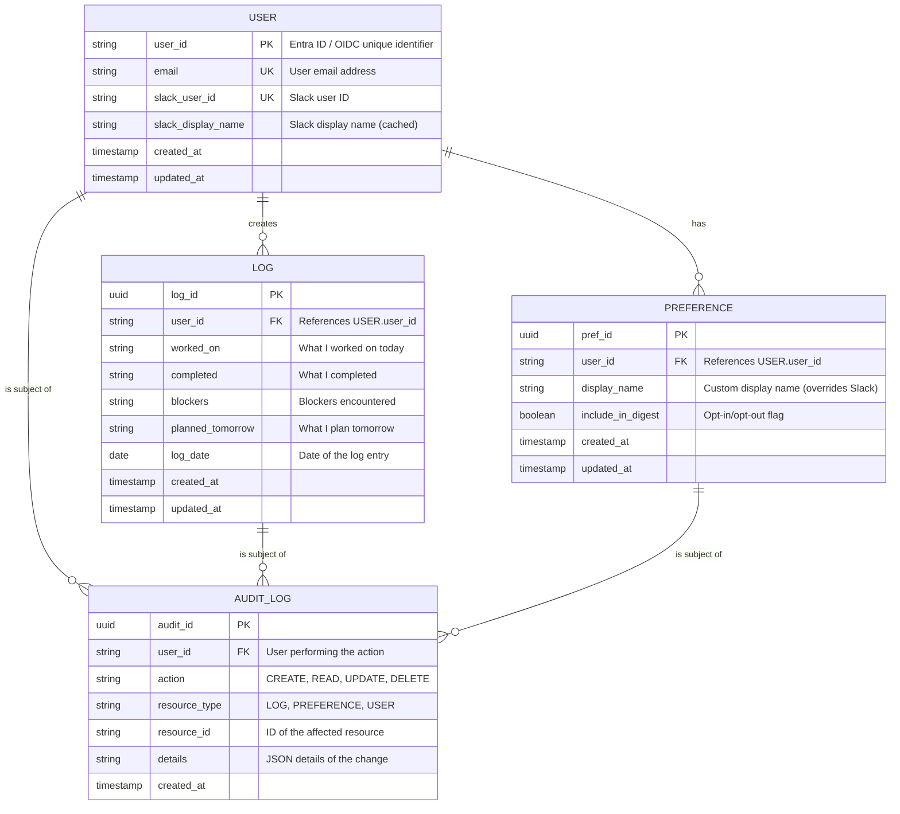
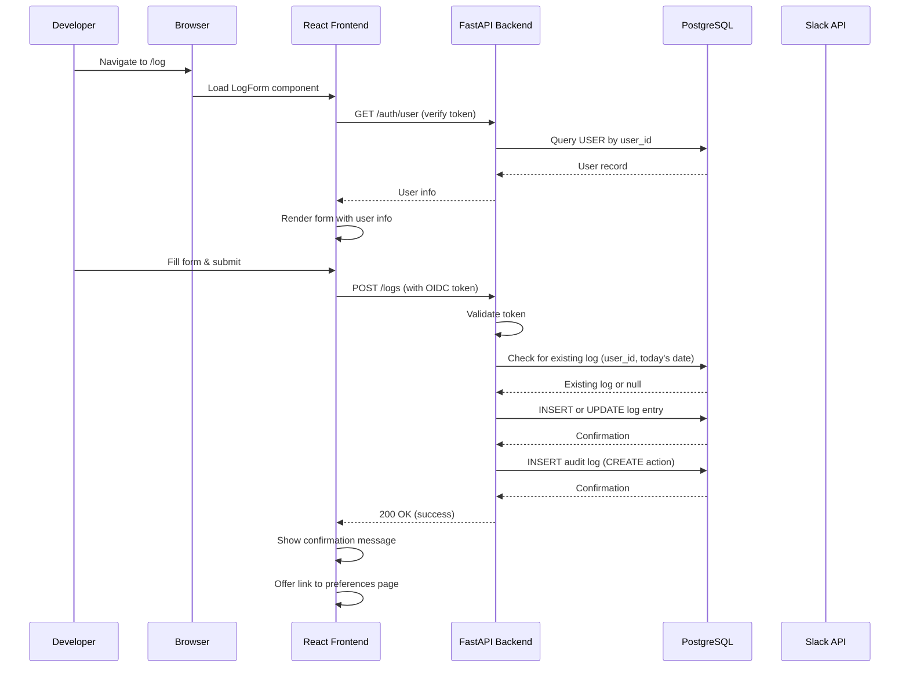
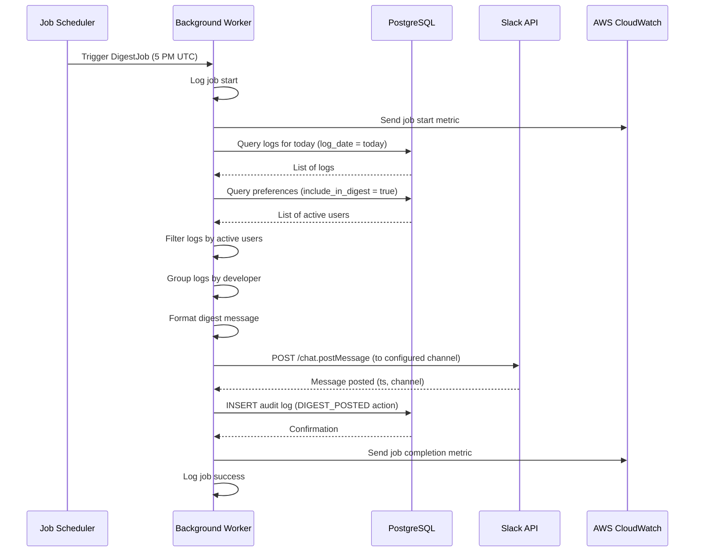
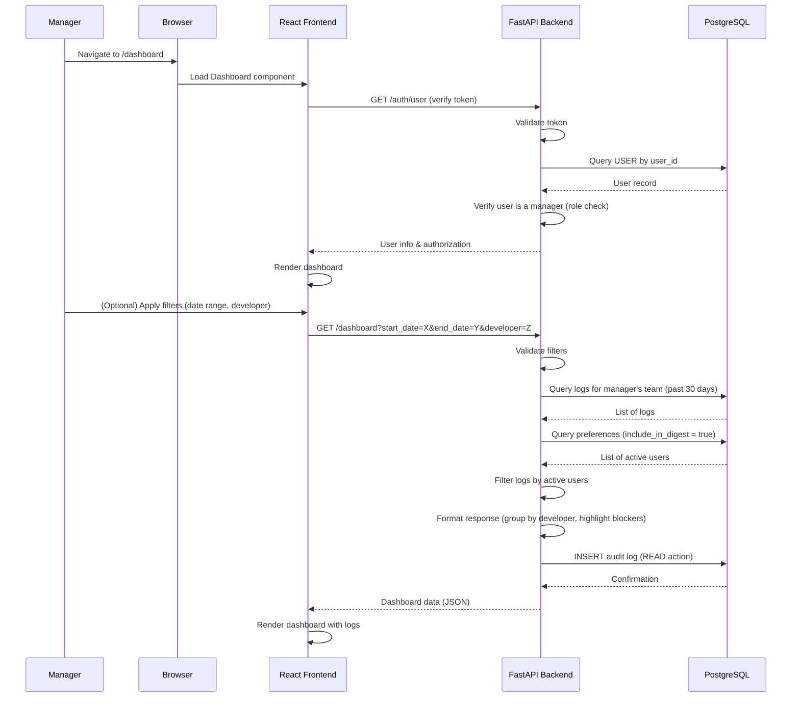

# DevLog: Solution Design Document (Architecture)

## Executive Summary

DevLog is a lightweight daily digest system that enables individual contributors to recap and share their work at the end of each business day. The system provides a frictionless entry point (web form and Slack shortcut), aggregates daily logs into a formatted team digest, and offers managers a rolling 30-day historical view of team progress.

This architecture document describes the technical approach for implementing DevLog using a Python-FastAPI backend, React frontend, and PostgreSQL database, deployed on AWS ECS Fargate with Docker containerization.

---

## 1. High-Level Architecture Overview

### 1.1 System Context

DevLog operates within an enterprise environment with the following external dependencies:

- **Slack Workspace**: Primary integration point for daily digest delivery and form submission shortcuts
- **Entra ID / OIDC Provider**: Authentication and identity management
- **AWS Infrastructure**: Cloud hosting, containerization, and managed services
- **PostgreSQL Database**: Persistent data storage for logs, user preferences, and audit trails

### 1.2 Core Principles

The architecture adheres to the following principles:

1. **Simplicity**: Minimal components, clear separation of concerns
2. **Scalability**: Stateless services that can be horizontally scaled
3. **Security**: Defense-in-depth with authentication, authorization, encryption, and audit logging
4. **Reliability**: Resilient job scheduling, error handling, and monitoring
5. **Maintainability**: Clear domain boundaries, consistent patterns, and comprehensive logging

---

## 2. System Context Diagram (C4 Level 1)



---

## 3. Container Diagram (C4 Level 2)



---

## 4. Component Diagram (C4 Level 3)

### 4.1 Backend Components



### 4.2 Frontend Components



### 4.3 Background Job Worker



---

## 5. Conceptual Database Design

### 5.1 Entity-Relationship Diagram (ERD)



### 5.2 Database Schema Details

#### USER Table
- **Purpose**: Stores user identity information synchronized from Entra ID / OIDC
- **Key Columns**:
  - `user_id`: Unique identifier from Entra ID (primary key)
  - `email`: User email (unique constraint)
  - `slack_user_id`: Slack user ID for Slack API calls (unique constraint)
  - `slack_display_name`: Cached Slack display name (refreshed on login)
- **Indexes**: `user_id` (PK), `email`, `slack_user_id`

#### LOG Table
- **Purpose**: Stores daily log entries submitted by developers
- **Key Columns**:
  - `log_id`: UUID primary key
  - `user_id`: Foreign key to USER
  - `log_date`: Date of the log entry (for grouping and filtering)
  - `worked_on`, `completed`, `blockers`, `planned_tomorrow`: Log content (all nullable)
  - `created_at`, `updated_at`: Timestamps for audit and sorting
- **Indexes**: `user_id`, `log_date`, `created_at` (for efficient queries on rolling 30-day window)
- **Constraints**: Unique constraint on `(user_id, log_date)` to prevent duplicate entries on the same day

#### PREFERENCE Table
- **Purpose**: Stores user preferences for display name and digest inclusion
- **Key Columns**:
  - `pref_id`: UUID primary key
  - `user_id`: Foreign key to USER (unique constraint)
  - `display_name`: Custom display name (nullable; defaults to Slack display name)
  - `include_in_digest`: Boolean flag (default: true)
- **Indexes**: `user_id` (unique)

#### AUDIT_LOG Table
- **Purpose**: Records all access and modifications for compliance and debugging
- **Key Columns**:
  - `audit_id`: UUID primary key
  - `user_id`: User performing the action
  - `action`: CREATE, READ, UPDATE, DELETE
  - `resource_type`: LOG, PREFERENCE, USER
  - `resource_id`: ID of the affected resource
  - `details`: JSON object with change details
  - `created_at`: Timestamp of the action
- **Indexes**: `user_id`, `resource_type`, `resource_id`, `created_at`
- **Note**: This table grows continuously; implement retention policy (e.g., 90-day retention)

---

## 6. Data Flow Diagrams

### 6.1 Developer Submits Daily Log (Web Form)



### 6.2 Nightly Digest Job Execution



### 6.3 Manager Views Dashboard



---

## 7. API Interface Overview

### 7.1 REST API Endpoints

#### Authentication & User Management

| Method | Endpoint | Description | Auth Required |
|--------|----------|-------------|---|
| GET | `/auth/user` | Get current authenticated user info | Yes (OIDC token) |
| GET | `/auth/login` | Initiate OIDC login flow | No |
| GET | `/auth/callback` | OIDC callback endpoint | No |
| POST | `/auth/logout` | Logout and clear session | Yes |

#### Log Management

| Method | Endpoint | Description | Auth Required |
|--------|----------|-------------|---|
| POST | `/logs` | Submit a new daily log | Yes |
| GET | `/logs/:id` | Retrieve a specific log | Yes (owner or manager) |
| GET | `/logs` | List user's own logs | Yes |
| PUT | `/logs/:id` | Update a log (same day only) | Yes (owner) |
| DELETE | `/logs/:id` | Delete a log (same day only) | Yes (owner) |

#### Preferences Management

| Method | Endpoint | Description | Auth Required |
|--------|----------|-------------|---|
| GET | `/preferences` | Get user preferences | Yes |
| PUT | `/preferences` | Update user preferences | Yes |

#### Dashboard (Manager Only)

| Method | Endpoint | Description | Auth Required |
|--------|----------|-------------|---|
| GET | `/dashboard` | Get team logs (past 30 days) | Yes (manager role) |
| GET | `/dashboard/filters` | Get available filters (developers, date range) | Yes (manager role) |

#### Slack Integration

| Method | Endpoint | Description | Auth Required |
|--------|----------|-------------|---|
| POST | `/slack/events` | Slack event subscription endpoint | Slack signature verification |
| POST | `/slack/shortcuts` | Slack shortcut submission | Slack signature verification |
| POST | `/slack/interactions` | Slack interactive component actions | Slack signature verification |

#### Health & Monitoring

| Method | Endpoint | Description | Auth Required |
|--------|----------|-------------|---|
| GET | `/health` | Health check endpoint | No |
| GET | `/metrics` | Prometheus metrics | No (internal only) |

### 7.2 Request/Response Examples

#### POST /logs - Submit Daily Log

**Request:**
```json
{
  "worked_on": "Implemented user authentication with OIDC",
  "completed": "Auth middleware and token validation",
  "blockers": "Waiting for Slack API credentials from DevOps",
  "planned_tomorrow": "Integrate Slack shortcut for log submission"
}
```

**Response (200 OK):**
```json
{
  "log_id": "550e8400-e29b-41d4-a716-446655440000",
  "user_id": "user@example.com",
  "log_date": "2024-01-15",
  "worked_on": "Implemented user authentication with OIDC",
  "completed": "Auth middleware and token validation",
  "blockers": "Waiting for Slack API credentials from DevOps",
  "planned_tomorrow": "Integrate Slack shortcut for log submission",
  "created_at": "2024-01-15T17:30:00Z",
  "updated_at": "2024-01-15T17:30:00Z"
}
```

#### GET /dashboard - Manager Dashboard

**Request:**
```
GET /dashboard?start_date=2024-01-01&end_date=2024-01-31&developer=john.doe
Authorization: Bearer <OIDC_TOKEN>
```

**Response (200 OK):**
```json
{
  "team_id": "engineering-team-1",
  "date_range": {
    "start": "2024-01-01",
    "end": "2024-01-31"
  },
  "logs": [
    {
      "log_id": "550e8400-e29b-41d4-a716-446655440000",
      "developer": "John Doe",
      "log_date": "2024-01-15",
      "worked_on": "Implemented user authentication with OIDC",
      "completed": "Auth middleware and token validation",
      "blockers": "Waiting for Slack API credentials from DevOps",
      "planned_tomorrow": "Integrate Slack shortcut for log submission",
      "has_blocker": true,
      "created_at": "2024-01-15T17:30:00Z"
    }
  ],
  "summary": {
    "total_entries": 15,
    "entries_by_developer": {
      "John Doe": 8,
      "Jane Smith": 7
    },
    "entries_with_blockers": 3
  }
}
```

---

## 8. Integration Patterns

### 8.1 Slack Integration

#### Slack Bolt for Python

The backend uses **Slack Bolt for Python** to handle:

1. **Event Subscriptions**: Listen for workspace events (e.g., app mentions)
2. **Shortcuts**: Handle "Log Daily Work" shortcut from Slack client
3. **Interactive Components**: Handle button clicks and form submissions in Slack modals
4. **Message Posting**: Send formatted daily digest to team channel

**Key Components:**

```python
# Pseudo-code structure
from slack_bolt import App
from slack_bolt.oauth.oauth_settings import OAuthSettings

app = App(
    signing_secret=os.environ["SLACK_SIGNING_SECRET"],
    token=os.environ["SLACK_BOT_TOKEN"],
    oauth_settings=OAuthSettings(
        client_id=os.environ["SLACK_CLIENT_ID"],
        client_secret=os.environ["SLACK_CLIENT_SECRET"],
        scopes=["chat:write", "users:read", "commands"]
    )
)

@app.shortcut("log_daily_work")
def handle_log_shortcut(ack, body, client):
    ack()
    # Open modal with log form
    client.views_open(
        trigger_id=body["trigger_id"],
        view={...}
    )

@app.view("log_submission")
def handle_log_submission(ack, body, view, client):
    ack()
    # Extract form data and call FastAPI backend
    # POST /logs with user info from Slack
```

#### Slack API Calls

- **Post Message**: `chat.postMessage` to post daily digest
- **Get User Info**: `users.info` to retrieve user display name and email
- **Open Modal**: `views.open` to display log form in Slack
- **Update Modal**: `views.update` for form validation feedback

### 8.2 Entra ID / OIDC Integration

#### OAuth 2.0 Authorization Code Flow

1. **Login Initiation**: User clicks "Login" → redirects to Entra ID
2. **Authorization**: User grants permission → Entra ID redirects to callback with authorization code
3. **Token Exchange**: Backend exchanges code for ID token and access token
4. **Token Validation**: Backend validates token signature and claims
5. **Session Management**: Backend stores token in secure HTTP-only cookie or session

**Key Libraries:**
- `python-jose`: JWT token validation
- `authlib`: OAuth 2.0 client library
- `fastapi-security`: FastAPI security utilities

**Implementation Pattern:**

```python
# Pseudo-code
from fastapi import Depends, HTTPException
from fastapi.security import HTTPBearer, HTTPAuthCredentials

security = HTTPBearer()

async def verify_token(credentials: HTTPAuthCredentials = Depends(security)):
    token = credentials.credentials
    try:
        payload = jwt.decode(
            token,
            key=OIDC_PUBLIC_KEY,
            algorithms=["RS256"],
            audience=OIDC_CLIENT_ID
        )
        user_id = payload.get("oid")  # Entra ID object ID
        email = payload.get("email")
        return {"user_id": user_id, "email": email}
    except JWTError:
        raise HTTPException(status_code=401, detail="Invalid token")

@app.post("/logs")
async def submit_log(log_data: LogSchema, user = Depends(verify_token)):
    # Process log submission
    pass
```

### 8.3 AWS Integration

#### ECS Fargate Deployment

- **Container Image**: Docker image built from Python FastAPI application
- **Task Definition**: Specifies container image, CPU/memory, environment variables, logging
- **Service**: Manages task scaling, load balancing, and health checks
- **Load Balancer**: AWS Application Load Balancer (ALB) for HTTP/HTTPS routing

#### RDS PostgreSQL

- **Database Instance**: Managed PostgreSQL database with automated backups
- **Encryption**: AWS RDS encryption at rest using AWS KMS
- **Security Groups**: Restrict access to ECS tasks only
- **Backup & Recovery**: Automated daily snapshots, point-in-time recovery

#### CloudWatch

- **Logs**: Application logs streamed from ECS tasks
- **Metrics**: Custom metrics for job execution, API latency, error rates
- **Alarms**: Alerts for job failures, high error rates, performance degradation
- **Dashboards**: Real-time monitoring of system health

#### EventBridge (for Scheduled Jobs)

- **Nightly Digest Job**: Scheduled rule triggers ECS task at 5 PM UTC
- **Data Cleanup Job**: Scheduled rule triggers cleanup task daily
- **Health Check Job**: Periodic health check every 5 minutes

---

## 9. Security Architecture

### 9.1 Authentication & Authorization

#### Authentication Flow

1. **OIDC Token Validation**: All API requests include OIDC token in Authorization header
2. **Token Verification**: Backend validates token signature, expiration, and audience
3. **User Context**: Extract user ID and email from token claims
4. **Session Management**: Store user context in request scope (stateless)

#### Authorization Rules

| Resource | Developer | Manager | Admin |
|----------|-----------|---------|-------|
| Own logs (read) | ✓ | ✓ | ✓ |
| Own logs (write) | ✓ | ✗ | ✓ |
| Team logs (read) | ✗ | ✓ | ✓ |
| Preferences (own) | ✓ | ✓ | ✓ |
| Dashboard | ✗ | ✓ | ✓ |

**Implementation**: Role-based access control (RBAC) middleware checks user role before processing requests.

### 9.2 Data Protection

#### Encryption in Transit

- **HTTPS/TLS 1.2+**: All API communication encrypted
- **Load Balancer**: AWS ALB terminates TLS, forwards to ECS tasks over private network
- **Slack API**: Uses HTTPS for all API calls

#### Encryption at Rest

- **Database**: AWS RDS encryption using AWS KMS
- **Secrets**: AWS Secrets Manager for API keys, database credentials, OIDC secrets
- **Logs**: CloudWatch logs encrypted at rest

### 9.3 Secrets Management

**Never hardcode secrets in source code or environment variables.**

**Approach:**
1. Store secrets in AWS Secrets Manager
2. ECS task execution role has permission to retrieve secrets
3. Secrets injected into container at runtime
4. Application reads from environment variables or Secrets Manager API

**Secrets to manage:**
- `SLACK_BOT_TOKEN`
- `SLACK_SIGNING_SECRET`
- `SLACK_CLIENT_ID`
- `SLACK_CLIENT_SECRET`
- `OIDC_CLIENT_ID`
- `OIDC_CLIENT_SECRET`
- `OIDC_PUBLIC_KEY`
- `DATABASE_URL`
- `JWT_SECRET_KEY`

### 9.4 Audit Logging

**All access and modifications are logged:**

- **CREATE**: Log submission, preference change
- **READ**: Dashboard access, log retrieval
- **UPDATE**: Log update, preference change
- **DELETE**: Log deletion

**Audit Log Fields:**
- `user_id`: User performing the action
- `action`: CREATE, READ, UPDATE, DELETE
- `resource_type`: LOG, PREFERENCE, USER
- `resource_id`: ID of the affected resource
- `details`: JSON object with change details (e.g., old value, new value)
- `timestamp`: When the action occurred
- `ip_address`: Source IP address (if available)

**Retention**: Audit logs retained for 90 days (configurable).

---

## 10. Quality Attributes & Non-Functional Requirements

### 10.1 Performance

| Attribute | Target | Implementation |
|-----------|--------|---|
| Form submission latency | ≤3 seconds (p95) | Optimized database queries, connection pooling, caching |
| Dashboard page load | ≤2 seconds (FCP/LCP) | Efficient API queries, pagination, frontend optimization |
| Nightly digest job | ≤5 minutes (100 developers) | Batch queries, efficient formatting, parallel processing |
| API response time | ≤500 ms (p95) | Database indexing, query optimization, caching |

**Optimization Strategies:**
- Database indexes on frequently queried columns (`user_id`, `log_date`, `created_at`)
- Connection pooling (SQLAlchemy with psycopg2)
- Caching layer for user preferences and Slack user info (Redis optional)
- Pagination for large result sets
- Async/await for I/O-bound operations (Slack API calls)

### 10.2 Reliability & Availability

| Attribute | Target | Implementation |
|-----------|--------|---|
| System uptime | 99.5% monthly | Multi-AZ deployment, health checks, auto-recovery |
| Nightly digest success rate | 99% | Retry logic, error handling, alerting |
| Data persistence | Zero data loss | Automated backups, point-in-time recovery |

**Reliability Patterns:**
- **Health Checks**: ECS task health checks every 30 seconds
- **Auto-Recovery**: Failed tasks automatically replaced
- **Retry Logic**: Exponential backoff for transient failures
- **Circuit Breaker**: Graceful degradation if Slack API is unavailable
- **Backup & Recovery**: Daily RDS snapshots, 7-day retention

### 10.3 Scalability

| Attribute | Target | Implementation |
|-----------|--------|---|
| Concurrent form submissions | 100 concurrent users | Horizontal scaling of ECS tasks, load balancing |
| Database query performance | ≤500 ms (30-day history, 100 developers) | Indexing, query optimization, connection pooling |

**Scaling Strategy:**
- **Horizontal Scaling**: ECS service auto-scales based on CPU/memory metrics
- **Database Scaling**: RDS read replicas for read-heavy dashboard queries
- **Caching**: Redis for frequently accessed data (optional)
- **Batch Processing**: Nightly digest job runs in separate worker process

### 10.4 Maintainability & Extensibility

| Attribute | Implementation |
|-----------|---|
| Code organization | Layered architecture (controllers, services, repositories) |
| Dependency management | pip/uv for Python, npm for frontend |
| Testing | pytest for backend, vitest for frontend, Playwright for E2E |
| Documentation | Inline comments, API documentation (OpenAPI/Swagger), architecture docs |
| Monitoring | CloudWatch logs, metrics, dashboards |
| Deployment | Docker containerization, CI/CD pipeline (GitHub Actions or similar) |

---

## 11. Deployment Architecture

### 11.1 Containerization

**Docker Image Structure:**

```dockerfile
# Backend
FROM python:3.11-slim
WORKDIR /app
COPY requirements.txt .
RUN pip install -r requirements.txt
COPY . .
CMD ["uvicorn", "main:app", "--host", "0.0.0.0", "--port", "8000"]

# Frontend (built separately, served by backend or CDN)
FROM node:18-alpine
WORKDIR /app
COPY package.json package-lock.json .
RUN npm ci
COPY . .
RUN npm run build
# Output: dist/ directory with static files
```

### 11.2 AWS ECS Fargate Deployment

**Architecture:**

```
┌─────────────────────────────────────────────────────────────┐
│                    AWS VPC (Private)                         │
│                                                               │
│  ┌──────────────────────────────────────────────────────┐   │
│  │         Application Load Balancer (ALB)              │   │
│  │  - Listens on port 443 (HTTPS)                       │   │
│  │  - Terminates TLS                                    │   │
│  │  - Routes to ECS tasks                               │   │
│  └──────────────────────────────────────────────────────┘   │
│                           │                                   │
│  ┌────────────────────────┴────────────────────────────┐    │
│  │                                                      │    │
│  │  ┌─────────────────┐  ┌─────────────────┐          │    │
│  │  │  ECS Task 1     │  │  ECS Task 2     │  ...     │    │
│  │  │  (FastAPI)      │  │  (FastAPI)      │          │    │
│  │  │  Port 8000      │  │  Port 8000      │          │    │
│  │  └─────────────────┘  └─────────────────┘          │    │
│  │                                                      │    │
│  │  ┌─────────────────┐  ┌─────────────────┐          │    │
│  │  │  ECS Task 3     │  │  ECS Task 4     │  ...     │    │
│  │  │  (Worker)       │  │  (Worker)       │          │    │
│  │  │  Background     │  │  Background     │          │    │
│  │  └─────────────────┘  └─────────────────┘          │    │
│  │                                                      │    │
│  └──────────────────────────────────────────────────────┘   │
│                           │                                   │
│  ┌────────────────────────┴────────────────────────────┐    │
│  │                                                      │    │
│  │  ┌─────────────────────────────────────────────┐   │    │
│  │  │  RDS PostgreSQL (Multi-AZ)                  │   │    │
│  │  │  - Primary instance                         │   │    │
│  │  │  - Standby replica (automatic failover)     │   │    │
│  │  │  - Encryption at rest (AWS KMS)             │   │    │
│  │  │  - Automated backups (7-day retention)      │   │    │
│  │  └─────────────────────────────────────────────┘   │    │
│  │                                                      │    │
│  └──────────────────────────────────────────────────────┘   │
│                                                               │
│  ┌──────────────────────────────────────────────────────┐   │
│  │         AWS Secrets Manager                          │   │
│  │  - SLACK_BOT_TOKEN                                   │   │
│  │  - OIDC_CLIENT_SECRET                               │   │
│  │  - DATABASE_URL                                      │   │
│  │  - Other sensitive config                            │   │
│  └──────────────────────────────────────────────────────┘   │
│                                                               │
│  ┌──────────────────────────────────────────────────────┐   │
│  │         AWS CloudWatch                               │   │
│  │  - Application logs                                  │   │
│  │  - Metrics (CPU, memory, latency)                    │   │
│  │  - Alarms (job failures, error rates)                │   │
│  │  - Dashboards (real-time monitoring)                 │   │
│  └──────────────────────────────────────────────────────┘   │
│                                                               │
│  ┌──────────────────────────────────────────────────────┐   │
│  │         AWS EventBridge                              │   │
│  │  - Nightly digest job (5 PM UTC, Mon-Fri)            │   │
│  │  - Data cleanup job (daily)                          │   │
│  │  - Health check job (every 5 minutes)                │   │
│  └──────────────────────────────────────────────────────┘   │
│                                                               │
└─────────────────────────────────────────────────────────────┘
```

### 11.3 CI/CD Pipeline

**Deployment Flow:**

```
┌──────────────┐
│ Git Commit   │
└──────┬───────┘
       │
       ▼
┌──────────────────────┐
│ GitHub Actions       │
│ (or similar CI/CD)   │
└──────┬───────────────┘
       │
       ├─ Run tests (pytest, vitest, Playwright)
       ├─ Build Docker image
       ├─ Push to ECR (Elastic Container Registry)
       │
       ▼
┌──────────────────────┐
│ Deploy to ECS        │
│ (update task def)    │
└──────┬───────────────┘
       │
       ▼
┌──────────────────────┐
│ ECS Rolling Update   │
│ (blue-green deploy)  │
└──────┬───────────────┘
       │
       ▼
┌──────────────────────┐
│ Health Checks        │
│ (verify deployment)  │
└──────────────────────┘
```

---

## 12. Architectural Decisions & Trade-offs

### 12.1 Key Architectural Decisions (ADRs)

#### ADR-1: Stateless Backend Services

**Decision**: Implement FastAPI backend as stateless microservices (no session state stored in-process).

**Rationale**:
- Enables horizontal scaling (multiple instances behind load balancer)
- Simplifies deployment and recovery
- Stateless design is cloud-native best practice

**Trade-offs**:
- Requires token-based authentication (OIDC) instead of session cookies
- Slightly more complex token validation on every request

---

#### ADR-2: Separate Background Job Worker

**Decision**: Run nightly digest job in separate ECS task (not in main API process).

**Rationale**:
- Prevents long-running jobs from blocking API requests
- Allows independent scaling of job worker
- Easier to monitor and debug job failures
- Enables retry logic without affecting API availability

**Trade-offs**:
- Adds operational complexity (manage two separate services)
- Requires job scheduling mechanism (EventBridge + ECS)

---

#### ADR-3: PostgreSQL for Relational Data

**Decision**: Use PostgreSQL as primary data store (no NoSQL).

**Rationale**:
- Strong ACID guarantees for data consistency
- Efficient querying for dashboard (complex filters, aggregations)
- Mature ecosystem, well-understood operational patterns
- Supports audit logging with JSON fields

**Trade-offs**:
- Less flexible schema compared to NoSQL
- Requires schema migrations for changes
- May require read replicas for scaling read-heavy workloads

---

#### ADR-4: Slack Bolt for Python

**Decision**: Use Slack Bolt for Python for Slack integration.

**Rationale**:
- Official Slack SDK, well-maintained
- Handles OAuth, event subscriptions, and interactive components
- Simplifies Slack API integration
- Built-in support for request signing verification

**Trade-offs**:
- Adds dependency on Slack SDK
- Requires understanding of Slack API concepts (events, shortcuts, modals)

---

#### ADR-5: OIDC for Authentication

**Decision**: Use Entra ID / OIDC for all authentication (no custom auth).

**Rationale**:
- Enterprise-grade security
- Centralized identity management
- Reduces burden of password management
- Supports multi-factor authentication (MFA)

**Trade-offs**:
- Requires OIDC provider setup (Entra ID)
- Token validation adds latency (mitigated by caching public keys)
- Dependency on external identity provider

---

### 12.2 Trade-offs & Considerations

#### Caching Strategy

**Decision**: Optional Redis caching layer for user preferences and Slack user info.

**Rationale**:
- User preferences are read frequently, change infrequently
- Slack user info (display name) is cached to reduce API calls
- Reduces database load and API latency

**Trade-offs**:
- Adds operational complexity (manage Redis cluster)
- Cache invalidation strategy required
- Not required for V1 (can be added later)

---

#### Database Scaling

**Decision**: Use RDS read replicas for read-heavy dashboard queries.

**Rationale**:
- Dashboard queries are read-only, can be routed to replicas
- Reduces load on primary database
- Improves dashboard performance

**Trade-offs**:
- Adds operational complexity (manage read replicas)
- Potential replication lag (eventual consistency)
- Not required for V1 (can be added if performance issues arise)

---

#### Frontend Deployment

**Decision**: Serve React frontend from same FastAPI backend (or separate CDN).

**Rationale**:
- Simpler deployment (single service)
- Easier CORS configuration
- Frontend and backend versions stay in sync

**Trade-offs**:
- Couples frontend and backend deployments
- Alternative: Serve frontend from CloudFront CDN (more complex, better performance)

---

## 13. Operational Considerations

### 13.1 Monitoring & Observability

**Metrics to Monitor:**

1. **API Metrics**:
   - Request latency (p50, p95, p99)
   - Error rate (4xx, 5xx responses)
   - Throughput (requests per second)
   - Database connection pool usage

2. **Job Metrics**:
   - Job execution time
   - Job success/failure rate
   - Number of logs aggregated
   - Slack API call latency

3. **Infrastructure Metrics**:
   - ECS task CPU/memory usage
   - RDS database CPU/memory/connections
   - Network I/O
   - Disk usage

4. **Business Metrics**:
   - Daily active users
   - Logs submitted per day
   - Digest posts per day
   - Dashboard views per day

**Alerting Rules:**

- API error rate > 1% → Alert
- Job execution time > 5 minutes → Alert
- Job failure → Alert immediately
- Database connection pool > 80% → Alert
- ECS task CPU > 80% for 5 minutes → Alert

---

### 13.2 Logging Strategy

**Log Levels:**

- **DEBUG**: Detailed information for debugging (disabled in production)
- **INFO**: General informational messages (API requests, job execution)
- **WARNING**: Warning messages (slow queries, retries)
- **ERROR**: Error messages (failed requests, job failures)
- **CRITICAL**: Critical errors (database connection failures, unhandled exceptions)

**Log Format:**

```json
{
  "timestamp": "2024-01-15T17:30:00Z",
  "level": "INFO",
  "logger": "api.logs",
  "message": "Log submitted successfully",
  "user_id": "user@example.com",
  "log_id": "550e8400-e29b-41d4-a716-446655440000",
  "duration_ms": 145,
  "request_id": "req-12345"
}
```

---

### 13.3 Disaster Recovery

**Backup Strategy:**

- **Database Backups**: Automated daily RDS snapshots, 7-day retention
- **Point-in-Time Recovery**: Restore database to any point in time within 7 days
- **Multi-AZ Deployment**: Automatic failover to standby replica in case of primary failure

**Recovery Procedures:**

1. **Database Failure**: Automatic failover to standby replica (RTO: < 2 minutes)
2. **ECS Task Failure**: Automatic replacement by ECS service (RTO: < 1 minute)
3. **Regional Failure**: Manual failover to secondary region (requires setup)

---

## 14. Future Enhancements (Out of Scope for V1)

The following features are explicitly out of scope for V1 but may be considered for future versions:

1. **AI Summarization**: Automatically summarize logs using NLP
2. **Sentiment Analysis**: Analyze sentiment of blocker entries
3. **Cross-Team Comparisons**: Compare productivity across teams
4. **Additional Integrations**: Microsoft Teams, Google Chat, email
5. **Advanced Analytics**: Trends, patterns, predictive insights
6. **Mobile App**: Native iOS/Android applications
7. **Customizable Digest Format**: Allow teams to customize digest layout
8. **Recurring Blockers**: Track and escalate recurring blockers
9. **Integration with Project Management Tools**: Link logs to Jira/GitHub issues
10. **Slack Workflow Integration**: Trigger workflows based on log entries

---

## 15. Conclusion

The DevLog architecture is designed to be simple, scalable, and secure. It leverages proven technologies (Python/FastAPI, React, PostgreSQL) and cloud-native patterns (containerization, horizontal scaling, managed services) to deliver a lightweight daily digest system that meets the product requirements.

Key strengths of this architecture:

- **Simplicity**: Minimal components, clear separation of concerns
- **Scalability**: Stateless services, horizontal scaling, database optimization
- **Security**: OIDC authentication, encryption in transit and at rest, audit logging
- **Reliability**: Multi-AZ deployment, automated backups, health checks
- **Maintainability**: Layered architecture, comprehensive logging, well-documented APIs

The architecture is ready for implementation and can be deployed to AWS ECS Fargate with standard CI/CD practices.

---

## Appendix: Technology Stack Summary

| Component | Technology | Version | Purpose |
|-----------|-----------|---------|---------|
| **Backend** | Python | 3.11+ | Server-side logic |
| **Web Framework** | FastAPI | Latest | REST API framework |
| **Frontend** | React | 18+ | Web UI |
| **Build Tool (Frontend)** | Vite | Latest | Frontend bundler |
| **Build Tool (Backend)** | pip/uv | Latest | Python dependency management |
| **Database** | PostgreSQL | 14+ | Relational data store |
| **Testing (Backend)** | pytest | Latest | Unit/integration tests |
| **Testing (Frontend)** | vitest | Latest | Frontend unit tests |
| **Testing (E2E)** | Playwright | Latest | End-to-end tests |
| **Authentication** | OIDC (Entra ID) | - | User authentication |
| **Slack Integration** | Slack Bolt for Python | Latest | Slack API client |
| **Deployment** | Docker | Latest | Containerization |
| **Orchestration** | AWS ECS Fargate | - | Container orchestration |
| **Database Service** | AWS RDS | PostgreSQL 14+ | Managed database |
| **Load Balancing** | AWS ALB | - | HTTP load balancing |
| **Job Scheduling** | AWS EventBridge | - | Scheduled jobs |
| **Monitoring** | AWS CloudWatch | - | Logs, metrics, alarms |
| **Secrets Management** | AWS Secrets Manager | - | Credential management |

---

**Document Version**: 1.0  
**Last Updated**: 2024-01-15  
**Status**: Ready for Implementation
