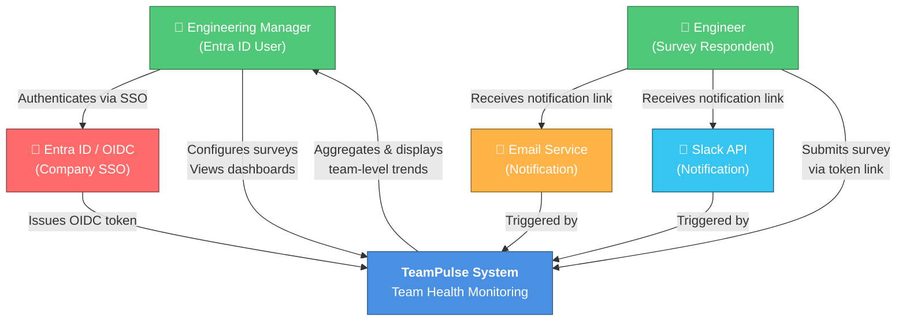
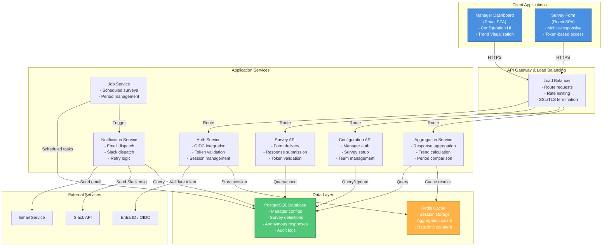
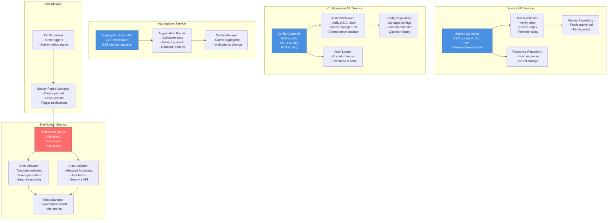
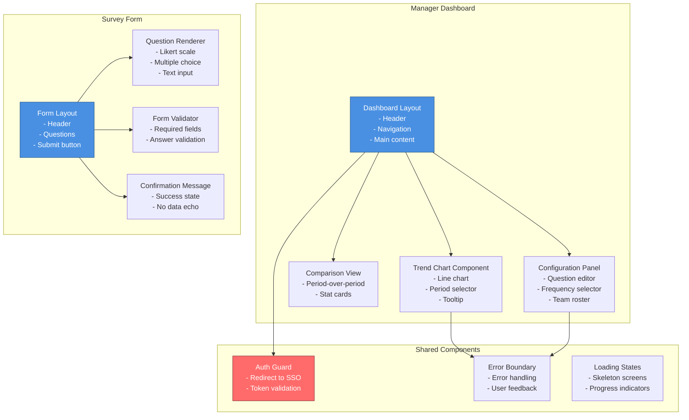
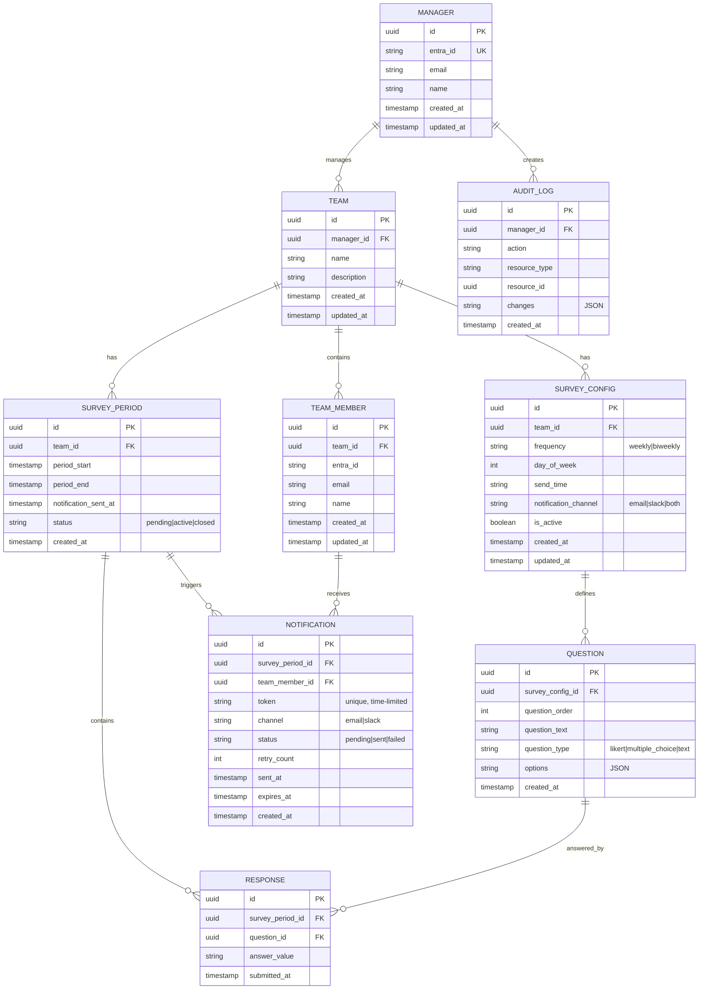
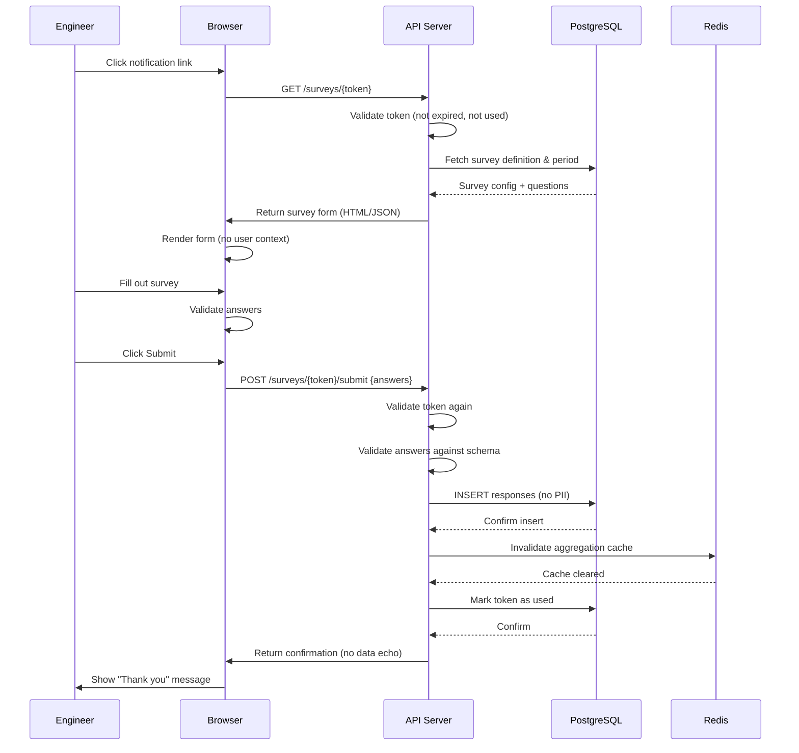
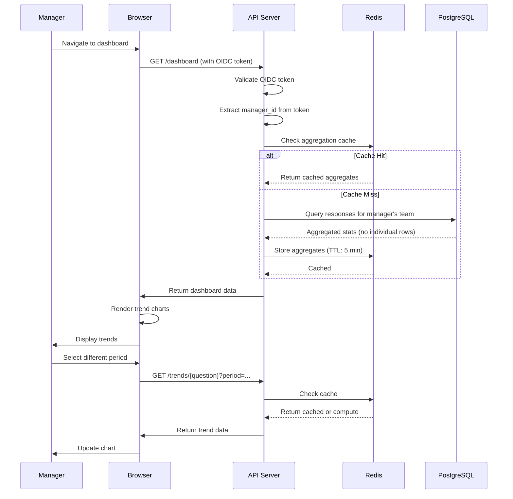
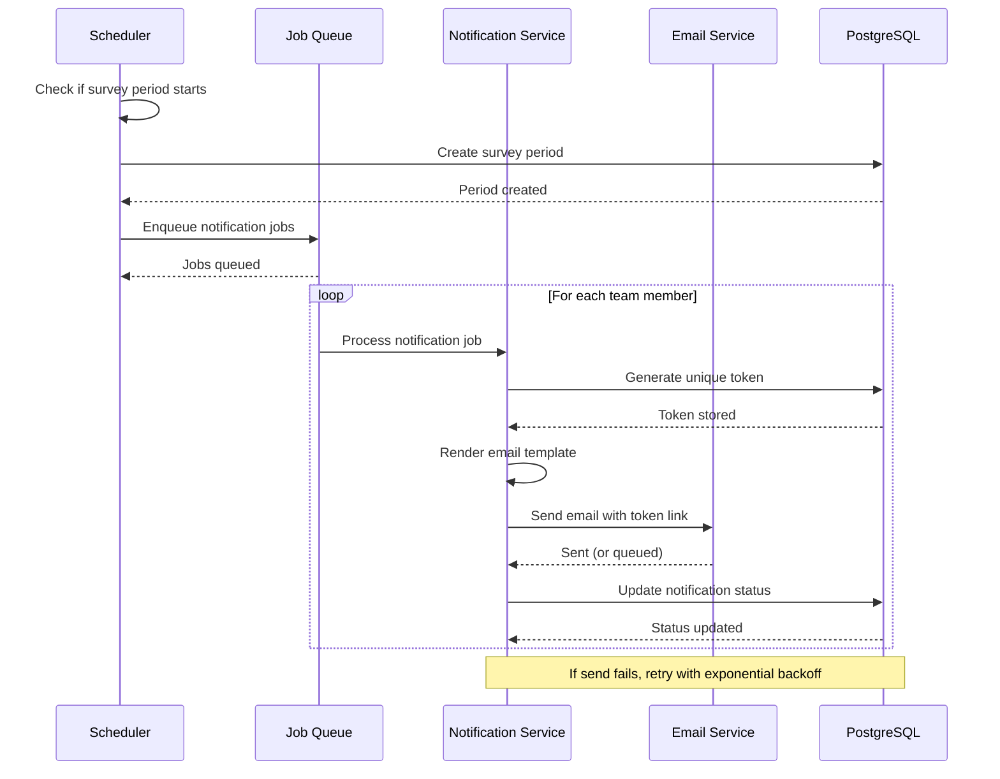
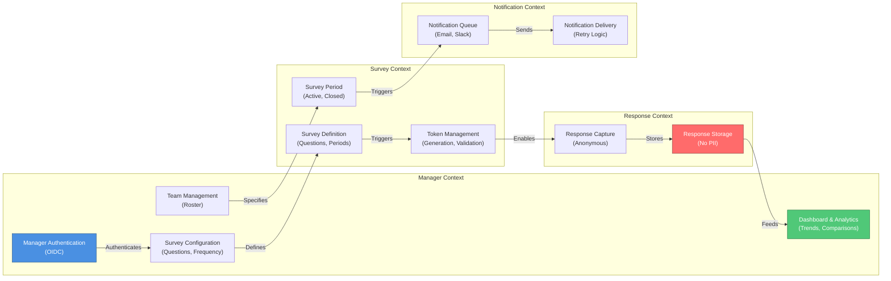

# TeamPulse — Architecture Document

**Version:** 1.0  
**Date:** 2026-06-28  
**Status:** Final  
**Prepared by:** Senior Solutions Architect

---

## Executive Summary

TeamPulse is a lightweight, privacy-first team health monitoring system designed for engineering organizations. This architecture document provides a technical blueprint for implementing a system that enables managers to run recurring anonymous pulse surveys while maintaining strict anonymity guarantees for respondents.

The system is built on a modern three-tier architecture using React (frontend), Node.js (backend), and PostgreSQL (database), with Entra ID/OIDC for manager authentication. The architecture emphasizes privacy-by-design, scalability, and performance to meet the non-functional requirements specified in the PRD.

**Key Architectural Principles:**
- **Privacy-by-Design**: Anonymity enforced at every layer (schema, API, UI)
- **Zero Individual Attribution**: No user identifiers stored with responses
- **Minimal Friction**: Engineers access surveys via tokenized links (no login)
- **Isolation**: Multiple teams with complete data separation
- **Scalability**: Stateless services, horizontal scaling, caching

---

## 1. High-Level Architecture Overview

### 1.1 System Layers

```
┌─────────────────────────────────────────────────────────────┐
│                    Presentation Layer (React)                │
│  ┌──────────────────────┐  ┌──────────────────────────────┐ │
│  │  Manager Dashboard   │  │  Survey Form (Anonymous)     │ │
│  │  & Configuration     │  │  (Token-based access)        │ │
│  └──────────────────────┘  └──────────────────────────────┘ │
└─────────────────────────────────────────────────────────────┘
                              ↓
┌─────────────────────────────────────────────────────────────┐
│              API Gateway / Load Balancer                     │
│         (Request routing, rate limiting, TLS)                │
└─────────────────────────────────────────────────────────────┘
                              ↓
┌─────────────────────────────────────────────────────────────┐
│                  Application Layer (Node.js)                 │
│  ┌──────────────┐  ┌──────────────┐  ┌──────────────────┐  │
│  │ Auth Service │  │ Survey API   │  │ Aggregation      │  │
│  │ (OIDC)       │  │ (Responses)  │  │ Service          │  │
│  └──────────────┘  └──────────────┘  └──────────────────┘  │
│  ┌──────────────┐  ┌──────────────┐  ┌──────────────────┐  │
│  │ Config API   │  │ Notification │  │ Scheduled Jobs   │  │
│  │ (Manager)    │  │ Service      │  │ (Survey cycles)  │  │
│  └──────────────┘  └──────────────┘  └──────────────────┘  │
└─────────────────────────────────────────────────────────────┘
                              ↓
┌─────────────────────────────────────────────────────────────┐
│                   Data Layer (PostgreSQL)                    │
│  ┌──────────────┐  ┌──────────────┐  ┌──────────────────┐  │
│  │ Manager      │  │ Survey       │  │ Responses        │  │
│  │ Configs      │  │ Definitions  │  │ (Anonymous)      │  │
│  └──────────────┘  └──────────────┘  └──────────────────┘  │
│  ┌──────────────┐  ┌──────────────┐  ┌──────────────────┐  │
│  │ Teams        │  │ Survey       │  │ Audit Logs       │  │
│  │              │  │ Periods      │  │                  │  │
│  └──────────────┘  └──────────────┘  └──────────────────┘  │
└─────────────────────────────────────────────────────────────┘
                              ↓
┌─────────────────────────────────────────────────────────────┐
│              External Services & Integrations                │
│  ┌──────────────┐  ┌──────────────┐  ┌──────────────────┐  │
│  │ Entra ID     │  │ Email        │  │ Slack API        │  │
│  │ (OIDC)       │  │ Service      │  │                  │  │
│  └──────────────┘  └──────────────┘  └──────────────────┘  │
└─────────────────────────────────────────────────────────────┘
```

### 1.2 Architectural Principles

1. **Privacy-by-Design**: Anonymity is enforced at every layer—database schema, API responses, and UI rendering.
2. **Separation of Concerns**: Manager-facing and engineer-facing flows are architecturally isolated.
3. **Stateless Backend**: Enables horizontal scaling and simplifies deployment.
4. **Event-Driven Notifications**: Decoupled notification delivery for reliability.
5. **Minimal Authentication Overhead**: Engineers access surveys via tokenized links; managers use SSO.
6. **Data Isolation**: Complete separation between teams; no cross-team data visibility.

---

## 2. System Context Map (C4 Level 1)



---

## 3. Container Diagram (C4 Level 2)



---

## 4. Component Diagram (C4 Level 3)

### 4.1 Backend Services Components



### 4.2 Frontend Components Architecture



---

## 5. Database Design

### 5.1 Entity-Relationship Diagram (ERD)



### 5.2 Privacy-Preserving Schema Design

**Critical Design Decision: No PII in Responses Table**

The `RESPONSE` table contains ONLY:
- `survey_period_id` (which team, which period)
- `question_id` (which question)
- `answer_value` (the response)
- `submitted_at` (timestamp)

**Explicitly NOT included:**
- `user_id`, `email`, `name`, `entra_id`
- `session_id`, `ip_address`, `device_fingerprint`
- Any identifier that could link response to individual

**Rationale:**
- Eliminates risk of accidental individual response exposure
- Simplifies privacy compliance (GDPR, CCPA, etc.)
- Prevents manager from inferring individual responses
- Enforces anonymity at schema level (not just application level)

**Query Example (Aggregation Only):**
```sql
SELECT 
    q.question_text,
    sp.period_start,
    sp.period_end,
    AVG(CAST(r.answer_value AS NUMERIC)) as avg_score,
    COUNT(DISTINCT r.id) as response_count
FROM responses r
JOIN survey_periods sp ON r.survey_period_id = sp.id
JOIN questions q ON r.question_id = q.id
WHERE sp.team_id = $1  -- Manager's team only
GROUP BY q.id, sp.period_start, sp.period_end
ORDER BY sp.period_start DESC;
```

**Never Exposed:**
- Individual response rows
- Per-user aggregates
- Drill-down to individual responses
- Raw response exports with user context

---

## 6. Data Flow Diagrams

### 6.1 Survey Submission Flow



### 6.2 Manager Dashboard Data Flow



### 6.3 Notification Dispatch Flow



---

## 7. API Interface Overview

### 7.1 Survey Submission API

```
POST /api/surveys/{token}/submit

Request:
{
  "answers": [
    { "question_id": "uuid", "answer": "4" },
    { "question_id": "uuid", "answer": "Strongly agree" }
  ]
}

Response (200 OK):
{
  "status": "submitted",
  "message": "Thank you for your feedback"
}

Response (400 Bad Request):
{
  "error": "Invalid or expired token"
}

Response (409 Conflict):
{
  "error": "Survey already submitted for this period"
}
```

### 7.2 Manager Dashboard API

```
GET /api/dashboard

Headers:
  Authorization: Bearer {oidc_token}

Response (200 OK):
{
  "team": {
    "id": "uuid",
    "name": "Backend Team"
  },
  "survey_config": {
    "frequency": "weekly",
    "questions": [...]
  },
  "trends": [
    {
      "question_id": "uuid",
      "question_text": "How satisfied are you?",
      "data_points": [
        { "period": "2026-06-21", "average": 4.2, "count": 8 },
        { "period": "2026-06-28", "average": 4.5, "count": 8 }
      ]
    }
  ],
  "comparison": {
    "current_period": {...},
    "previous_period": {...}
  }
}

Response (403 Forbidden):
{
  "error": "Not authorized to view this team's data"
}
```

### 7.3 Configuration API

```
PUT /api/config

Headers:
  Authorization: Bearer {oidc_token}

Request:
{
  "frequency": "biweekly",
  "notification_channel": "slack",
  "questions": [
    { "question_text": "How is morale?", "type": "likert" },
    { "question_text": "Blockers?", "type": "text" }
  ],
  "team_members": [
    { "entra_id": "user@company.com" }
  ]
}

Response (200 OK):
{
  "status": "updated",
  "config": {...}
}

Response (422 Unprocessable Entity):
{
  "error": "Question count must be 5-7"
}
```

---

## 8. Integration Patterns

### 8.1 Entra ID / OIDC Integration

**Flow:**
1. Manager navigates to TeamPulse dashboard
2. Unauthenticated request → redirect to Entra ID login
3. Manager authenticates with company credentials
4. Entra ID returns OIDC token (ID token + access token)
5. TeamPulse validates token signature and claims
6. Extract `sub` (subject) claim → manager identity
7. Store session in Redis with token claims
8. Subsequent requests include session cookie

**Security Measures:**
- Tokens validated server-side on every request
- No token storage in browser local storage (httpOnly cookies only)
- Session expiry: 8 hours of inactivity
- Token refresh via refresh token (if using refresh flow)

### 8.2 Email Notification Integration

**Provider:** SendGrid, AWS SES, or similar

**Flow:**
1. Notification service generates unique token
2. Renders email template with survey link
3. Sends via email provider API
4. Tracks delivery status (webhook from provider)
5. Retries failed sends with exponential backoff (max 5 retries)

**Template Example:**
```
Subject: Your team health check survey is ready

Hi there,

Your manager has sent out a quick team health survey. 
Please take 2-3 minutes to share your feedback:

[Click here to complete survey](https://teampulse.company.com/surveys/{token})

This link expires in 48 hours.

Thanks,
TeamPulse
```

### 8.3 Slack Notification Integration

**Flow:**
1. Notification service looks up engineer's Slack user ID (via Slack directory API)
2. Generates unique token
3. Sends direct message via Slack Bot API
4. Tracks delivery status
5. Retries if failed

**Message Format:**
```
Hi there! Your team health check survey is ready.
Take 2-3 minutes to share your feedback:

[Complete Survey](https://teampulse.company.com/surveys/{token})

This link expires in 48 hours.
```

---

## 9. Domain-Driven Design (DDD) Context Map



---

## 10. Security Considerations

### 10.1 Authentication & Authorization

| Concern | Mitigation |
|---------|-----------|
| **Manager impersonation** | OIDC token validation on every request; server-side authorization checks |
| **Cross-team data access** | All queries filtered by authenticated manager's team_id; API returns 403 for unauthorized access |
| **Engineer authentication** | Token-based access (no login required); tokens are single-use and time-limited |
| **Session hijacking** | httpOnly, Secure cookies; 8-hour inactivity timeout; CSRF tokens on state-changing requests |
| **Token reuse** | Tokens marked as used after first submission; expiry enforced server-side |

### 10.2 Privacy & Data Protection

| Concern | Mitigation |
|---------|-----------|
| **Individual response exposure** | No user identifiers stored with responses; aggregation-only queries |
| **Notification token reuse** | Tokens marked as used after first submission; expiry enforced |
| **Accidental PII logging** | Code review checklist; no logging of request/response bodies; audit logging separate from response data |
| **Data retention** | Automatic purge of responses > 24 months; audit logs archived separately |
| **Minimum anonymity threshold** | Suppress results if response count falls below threshold (OQ-05) |

### 10.3 API Security

| Concern | Mitigation |
|---------|-----------|
| **Rate limiting** | 100 requests/minute per IP; 10 requests/minute per token for survey submission |
| **SQL injection** | Parameterized queries; ORM usage (e.g., Sequelize, TypeORM) |
| **XSS attacks** | React's built-in XSS protection; Content Security Policy headers |
| **CSRF attacks** | CSRF tokens on state-changing requests; SameSite cookie attribute |
| **API enumeration** | No information leakage in error messages; consistent response times |

### 10.4 Infrastructure Security

| Concern | Mitigation |
|---------|-----------|
| **Data in transit** | TLS 1.2+ for all connections; HSTS headers |
| **Data at rest** | PostgreSQL encryption at rest (if available); encrypted backups |
| **Secrets management** | Environment variables for API keys; no hardcoded secrets; rotate regularly |
| **Access control** | Least privilege for database users; separate read-only role for analytics |
| **Backup security** | Encrypted backups; restricted access to backup storage |

---

## 11. Quality Attributes & Non-Functional Requirements

### 11.1 Performance

| Requirement | Target | Implementation |
|-------------|--------|-----------------|
| **Survey form LCP** | ≤ 2.5s (4G mobile) | Code splitting; lazy loading; optimized assets |
| **Dashboard load** | ≤ 3s (p95) | Redis caching of aggregates; pagination; indexed queries |
| **API response time** | ≤ 200ms (p95) | Connection pooling; query optimization; CDN for static assets |
| **Survey completion time** | ≤ 3 minutes (80% of users) | Minimal form fields; optimized UI; usability testing |

**Caching Strategy:**
- Aggregation results cached for 5 minutes (invalidated on new response)
- Survey definitions cached for 1 hour
- Manager session cached in Redis (8-hour TTL)

### 11.2 Scalability

| Dimension | Approach |
|-----------|----------|
| **Horizontal scaling** | Stateless Node.js services behind load balancer |
| **Database scaling** | Read replicas for dashboard queries; write to primary |
| **Notification scaling** | Job queue (Bull, RabbitMQ) for async processing |
| **Storage scaling** | PostgreSQL partitioning by survey_period_id for responses table |

**Capacity Planning:**
- Support 10,000+ managers
- Support 100,000+ engineers
- Handle 52 survey periods/year × 100,000 engineers = 5.2M responses/year
- Peak load: 10,000 concurrent survey submissions (during notification window)

### 11.3 Reliability

| Requirement | Implementation |
|-------------|-----------------|
| **Notification delivery** | ≥ 95% within 15 minutes | Retry logic; delivery tracking; alerting |
| **Data durability** | No response loss | Transactional writes; backup strategy |
| **System availability** | ≥ 99.5% uptime | Health checks; auto-scaling; failover |

**Monitoring & Alerting:**
- Alert if notification delivery latency > 15 minutes
- Alert if response insertion fails
- Alert if aggregation cache miss rate > 20%
- Alert if API error rate > 1%

### 11.4 Maintainability

| Aspect | Approach |
|--------|----------|
| **Code organization** | Modular service architecture; clear separation of concerns |
| **Testing** | Unit tests (>80% coverage); integration tests; API contract tests |
| **Documentation** | API docs (OpenAPI/Swagger); architecture diagrams; runbooks |
| **Logging** | Structured logging (JSON); correlation IDs for request tracing |

---

## 12. Architectural Decision Records (ADRs)

### ADR-1: Anonymous Response Storage

**Decision:** Store responses without any user identifier.

**Rationale:**
- Eliminates risk of accidental individual response exposure
- Simplifies privacy compliance (GDPR, CCPA, etc.)
- Prevents manager from inferring individual responses
- Enforces anonymity at schema level (not just application level)

**Consequences:**
- Cannot support per-user response history
- Cannot support per-user opt-out (only team-level)
- Requires careful token-based access control
- Aggregation-only queries (no drill-down capability)

**Alternatives Considered:**
- Store user ID but encrypt it (rejected: still creates linkage risk)
- Store user ID in separate table (rejected: still creates linkage risk)

---

### ADR-2: Token-Based Survey Access

**Decision:** Engineers access surveys via single-use, time-limited tokens instead of logging in.

**Rationale:**
- Minimizes friction (no password/SSO for engineers)
- Prevents engineer authentication data from being stored
- Enables anonymous submission (no session tied to response)
- Supports offline/mobile use cases

**Consequences:**
- Requires reliable token generation and validation
- Tokens must be delivered securely (email/Slack)
- Cannot support mid-survey resumption (must complete in one session)
- Cannot support per-user response history

**Alternatives Considered:**
- Engineer login via SSO (rejected: creates authentication linkage)
- QR code + anonymous session (rejected: more complex, same privacy benefit)

---

### ADR-3: Aggregation-Only API Responses

**Decision:** All manager-facing APIs return only aggregated data; individual responses are never exposed.

**Rationale:**
- Enforces anonymity at API layer
- Prevents accidental exposure via API misuse
- Simplifies authorization (no per-response checks needed)
- Aligns with privacy-by-design principles

**Consequences:**
- Cannot support drill-down to individual responses
- Cannot support response-level filtering (e.g., "show only responses from Q2")
- Requires careful query design to ensure aggregation
- May require data warehouse for advanced analytics

**Alternatives Considered:**
- Row-level security (rejected: more complex, still risky)
- Differential privacy (rejected: overkill for this use case)

---

### ADR-4: Separate Notification & Response Tables

**Decision:** Track notification delivery separately from response data.

**Rationale:**
- Prevents joining notification records (which contain team_member_id) with responses
- Reduces risk of accidental PII exposure
- Simplifies audit logging (notification events separate from response events)
- Enables independent scaling of notification and response systems

**Consequences:**
- Requires careful query design to avoid joins
- Slightly more complex notification tracking
- Clearer separation of concerns
- Easier to audit and verify privacy guarantees

---

## 13. Deployment Architecture

### 13.1 Deployment Topology

```
┌─────────────────────────────────────────────────────┐
│              AWS / Cloud Provider                    │
│                                                      │
│  ┌──────────────────────────────────────────────┐  │
│  │  CDN (CloudFront / Cloudflare)               │  │
│  │  - Static assets (JS, CSS, images)           │  │
│  │  - Geo-distributed caching                   │  │
│  └──────────────────────────────────────────────┘  │
│                      ↓                               │
│  ┌──────────────────────────────────────────────┐  │
│  │  Load Balancer (ALB / NLB)                   │  │
│  │  - TLS termination                           │  │
│  │  - Request routing                           │  │
│  │  - Health checks                             │  │
│  └──────────────────────────────────────────────┘  │
│                      ↓                               │
│  ┌──────────────────────────────────────────────┐  │
│  │  Auto Scaling Group (Node.js Services)       │  │
│  │  - Min: 2 instances                          │  │
│  │  - Max: 10 instances                         │  │
│  │  - Target: 70% CPU utilization               │  │
│  └──────────────────────────────────────────────┘  │
│                      ↓                               │
│  ┌──────────────────────────────────────────────┐  │
│  │  RDS PostgreSQL (Multi-AZ)                   │  │
│  │  - Primary + standby replica                 │  │
│  │  - Automated backups (30-day retention)      │  │
│  │  - Read replicas for analytics               │  │
│  └──────────────────────────────────────────────┘  │
│                      ↓                               │
│  ┌──────────────────────────────────────────────┐  │
│  │  ElastiCache (Redis)                         │  │
│  │  - Session storage                           │  │
│  │  - Aggregation cache                         │  │
│  │  - Rate limit counters                       │  │
│  └──────────────────────────────────────────────┘  │
│                                                      │
│  ┌──────────────────────────────────────────────┐  │
│  │  SQS / Job Queue                             │  │
│  │  - Notification jobs                         │  │
│  │  - Scheduled tasks                           │  │
│  └──────────────────────────────────────────────┘  │
│                                                      │
└─────────────────────────────────────────────────────┘
```

### 13.2 CI/CD Pipeline

```
Developer Push
    ↓
GitHub Actions / GitLab CI
    ↓
┌─────────────────────────────────┐
│  1. Lint & Format Check         │
│  2. Unit Tests (>80% coverage)  │
│  3. Integration Tests           │
│  4. Security Scan (SAST)        │
│  5. Build Docker Image          │
│  6. Push to Registry            │
└─────────────────────────────────┘
    ↓
┌─────────────────────────────────┐
│  Dev Environment Deployment     │
│  - Automated tests              │
│  - Smoke tests                  │
└─────────────────────────────────┘
    ↓
┌─────────────────────────────────┐
│  Staging Environment            │
│  - Load testing                 │
│  - Security testing             │
│  - Manual QA                    │
└─────────────────────────────────┘
    ↓
┌─────────────────────────────────┐
│  Production Deployment          │
│  - Blue-green deployment        │
│  - Canary rollout (10% → 100%)  │
│  - Health checks & monitoring   │
└─────────────────────────────────┘
```

---

## 14. Monitoring & Observability

### 14.1 Key Metrics

**Application Metrics:**
- API response time (p50, p95, p99)
- Error rate (4xx, 5xx)
- Notification delivery latency
- Notification delivery success rate
- Aggregation cache hit rate
- Database query time (p95)

**Business Metrics:**
- Survey completion rate
- Manager dashboard usage
- Configuration change frequency
- Notification delivery reliability

**Infrastructure Metrics:**
- CPU utilization
- Memory utilization
- Disk I/O
- Network latency
- Database connection pool utilization

### 14.2 Logging Strategy

**Structured Logging (JSON):**
```json
{
  "timestamp": "2026-06-28T10:30:45Z",
  "level": "INFO",
  "service": "survey-api",
  "request_id": "req-12345",
  "action": "survey_submitted",
  "survey_period_id": "uuid",
  "response_time_ms": 145,
  "status": "success"
}
```

**Log Aggregation:** ELK Stack, Datadog, or CloudWatch

**Retention:**
- Application logs: 30 days
- Audit logs: 1 year
- Error logs: 90 days

---

## 15. Testing Strategy

### 15.1 Test Pyramid

```
        ▲
       ╱ ╲
      ╱   ╲  E2E Tests (10%)
     ╱─────╲ - User workflows
    ╱       ╲ - Dashboard flows
   ╱─────────╲
  ╱           ╲ Integration Tests (30%)
 ╱─────────────╲ - API contracts
╱               ╲ - Database interactions
╱─────────────────╲
│                 │ Unit Tests (60%)
│  Unit Tests     │ - Business logic
│                 │ - Utilities
│                 │ - Validators
└─────────────────┘
```

### 15.2 Test Coverage

| Layer | Coverage Target | Examples |
|-------|-----------------|----------|
| **Unit** | >80% | Token validation, aggregation logic, validators |
| **Integration** | >70% | API endpoints, database queries, notification dispatch |
| **E2E** | >50% | Manager dashboard flow, survey submission flow |
| **Security** | >90% | Authorization checks, PII exposure tests |

### 15.3 Privacy & Anonymity Tests

```javascript
// Verify no PII in responses table
test('responses table has no user identifiers', async () => {
  const columns = await db.query(`
    SELECT column_name FROM information_schema.columns
    WHERE table_name = 'responses'
  `);
  const columnNames = columns.map(c => c.column_name);
  expect(columnNames).not.toContain('user_id');
  expect(columnNames).not.toContain('email');
  expect(columnNames).not.toContain('entra_id');
});

// Verify API never returns individual responses
test('dashboard API returns only aggregated data', async () => {
  const response = await api.get('/dashboard', { token: managerToken });
  expect(response.body.trends).toBeDefined();
  expect(response.body.trends[0].data_points).toBeDefined();
  expect(response.body.trends[0].individual_responses).toBeUndefined();
});

// Verify token-based access prevents manager impersonation
test('manager cannot access other team data', async () => {
  const response = await api.get('/dashboard?team_id=other_team', { 
    token: managerToken 
  });
  expect(response.status).toBe(403);
});
```

---

## 16. Operational Runbooks

### 16.1 Incident Response

**Notification Delivery Failure:**
1. Check notification service logs for errors
2. Verify email/Slack API connectivity
3. Check job queue for stuck jobs
4. Manually retry failed notifications
5. Notify affected managers via dashboard alert

**Data Integrity Issue:**
1. Verify no PII was exposed in responses table
2. Check audit logs for unauthorized access
3. Run data validation queries
4. Escalate to security team if needed

**Performance Degradation:**
1. Check database query performance (slow query log)
2. Check cache hit rate
3. Check auto-scaling metrics
4. Scale up if needed
5. Investigate root cause (query optimization, etc.)

---

## 17. Future Enhancements (Out of Scope for V1)

1. **ML-Based Sentiment Analysis**: Analyze text responses for sentiment trends
2. **Cross-Team Comparison**: Allow executives to compare team health across organization
3. **HR System Integration**: Sync team membership with HR system
4. **Mobile Native Apps**: Native iOS/Android apps for survey completion
5. **Advanced Analytics**: Cohort analysis, correlation with business metrics
6. **Survey Templates**: Pre-built survey templates for common scenarios
7. **Response Export**: Anonymized response export for further analysis

---

## 18. Glossary

| Term | Definition |
|------|-----------|
| **Anonymity** | No user identifier is stored or exposed in relation to survey responses |
| **Aggregation** | Combining responses at the team + survey period level (e.g., average score) |
| **Bounded Context** | A domain-driven design concept; in this case, survey management is isolated from manager identity |
| **C4 Model** | A hierarchical architecture modeling approach (Context, Container, Component, Code) |
| **DDD** | Domain-Driven Design; aligning architecture with business domains |
| **OIDC** | OpenID Connect; authentication protocol built on OAuth 2.0 |
| **Survey Period** | A time window (e.g., one week) during which a survey is active |
| **Token** | A unique, single-use, time-limited identifier for accessing a survey form |
| **Minimum Anonymity Threshold** | Minimum response count below which results are suppressed to prevent inference |

---

## 19. Conclusion

The TeamPulse architecture is designed with privacy-by-design principles, ensuring that anonymity is enforced at every layer—from the database schema to API responses to UI rendering. The system leverages modern cloud-native patterns (microservices, event-driven architecture, caching) to achieve scalability and performance targets while maintaining strict data protection guarantees.

**Key Architectural Strengths:**
- **Privacy-first**: No PII stored with responses; aggregation-only queries
- **Scalable**: Stateless services, horizontal scaling, caching
- **Reliable**: Retry logic, monitoring, alerting
- **Maintainable**: Clear separation of concerns, comprehensive testing
- **Compliant**: Designed to meet GDPR, CCPA, and other privacy regulations

**Implementation Readiness:**
The architecture is ready for implementation by a development team using React, Node.js, and PostgreSQL as specified in the PRD. All diagrams, data flows, and API specifications are provided to guide development.

---

**Document Version History:**

| Version | Date | Author | Changes |
|---------|------|--------|---------|
| 1.0 | 2026-06-28 | Senior Solutions Architect | Initial architecture document (Final PRD) |
