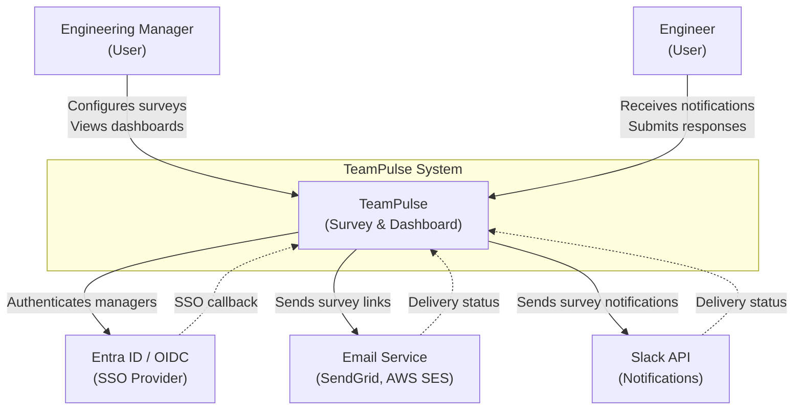
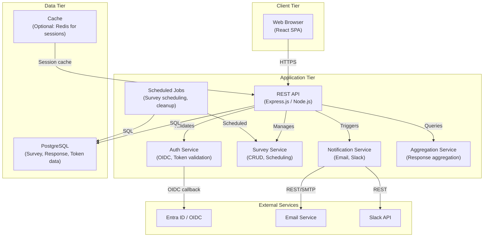
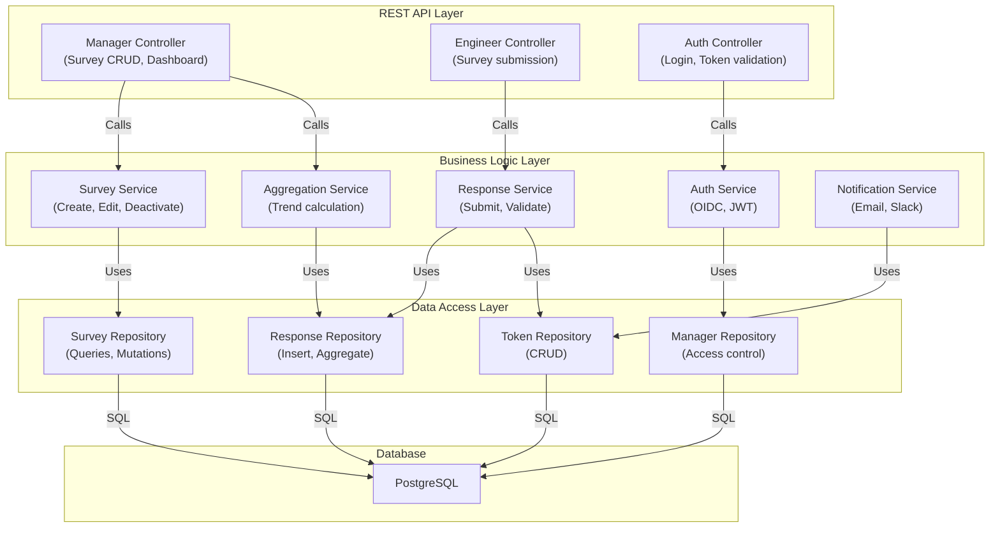
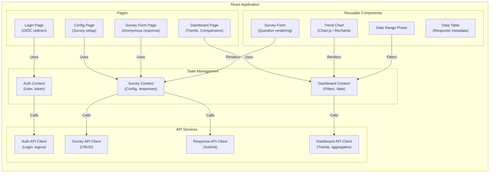
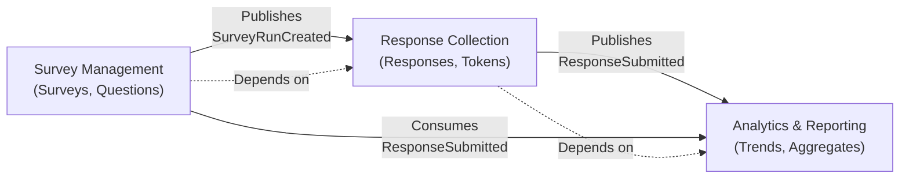
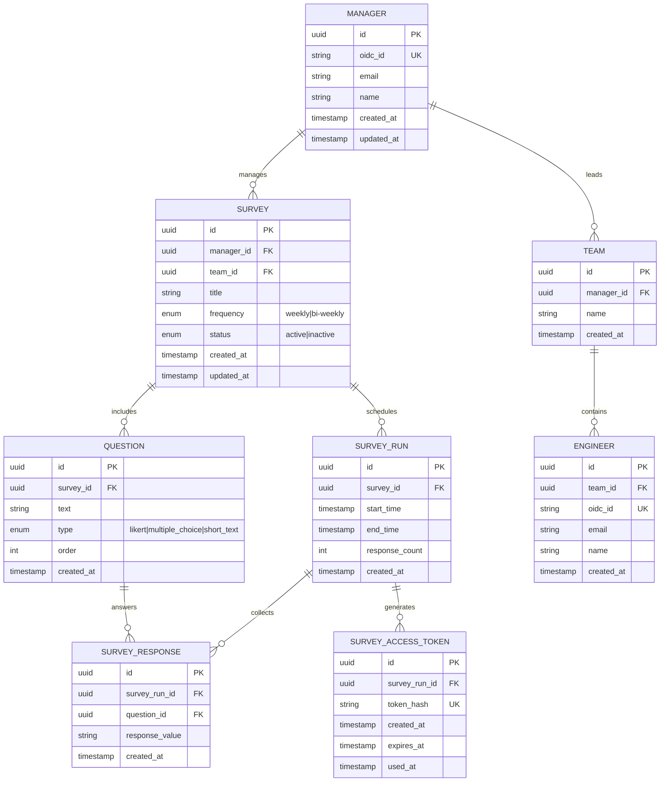
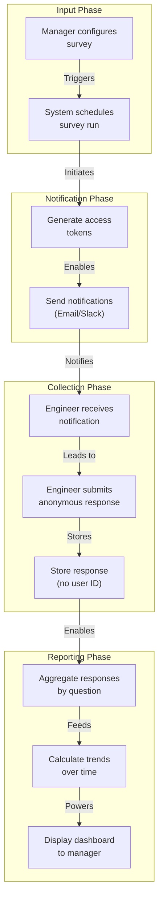
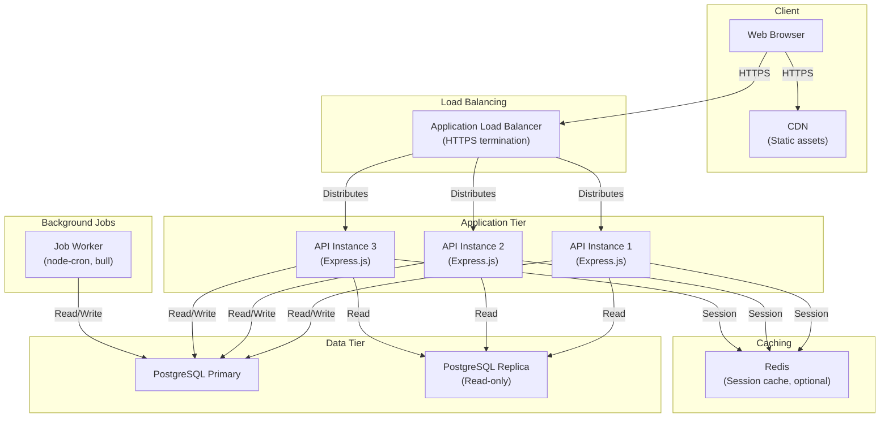

# TeamPulse Architecture Document

## Executive Summary

TeamPulse is a lightweight team health check system that enables engineering managers to collect anonymous, recurring pulse survey feedback from their teams. The architecture is designed around two core principles:

1. **Privacy by Design**: Anonymous data storage at the database layer ensures no individual attribution is possible, even in raw database exports
2. **Simplicity & Scalability**: A three-tier PERN stack (PostgreSQL, Express.js/Node.js, React) with clear separation of concerns enables rapid development and horizontal scaling

This document describes the technical approach, system decomposition, data models, integrations, and quality attributes that guide TeamPulse's implementation.

---

## 1. High-Level Architecture

### 1.1 Architecture Overview

TeamPulse follows a **three-tier client-server architecture** with clear separation between presentation, business logic, and data persistence layers:

```
┌─────────────────────────────────────────────────────────────────┐
│                         CLIENT TIER                              │
│  ┌──────────────────────────────────────────────────────────┐   │
│  │  React Single-Page Application (SPA)                     │   │
│  │  - Manager Dashboard (Trend visualization)               │   │
│  │  - Survey Configuration UI                               │   │
│  │  - Engineer Survey Form (Anonymous)                      │   │
│  └──────────────────────────────────────────────────────────┘   │
└─────────────────────────────────────────────────────────────────┘
                              ↕ HTTPS
┌─────────────────────────────────────────────────────────────────┐
│                       APPLICATION TIER                           │
│  ┌──────────────────────────────────────────────────────────┐   │
│  │  Express.js / Node.js Backend                            │   │
│  │  - REST API (Manager & Engineer endpoints)               │   │
│  │  - Authentication & Authorization (OIDC, Token)          │   │
│  │  - Business Logic (Survey management, Aggregation)       │   │
│  │  - Notification Service (Email, Slack)                   │   │
│  │  - Scheduled Tasks (Survey scheduling, Token cleanup)    │   │
│  └──────────────────────────────────────────────────────────┘   │
└─────────────────────────────────────────────────────────────────┘
                              ↕ SQL
┌─────────────────────────────────────────────────────────────────┐
│                        DATA TIER                                 │
│  ┌──────────────────────────────────────────────────────────┐   │
│  │  PostgreSQL Database                                     │   │
│  │  - Survey Configuration (Surveys, Questions)             │   │
│  │  - Anonymous Responses (No user identifiers)             │   │
│  │  - Access Control (Managers, Teams)                      │   │
│  │  - Audit Logs (Token usage, access patterns)             │   │
│  └──────────────────────────────────────────────────────────┘   │
└─────────────────────────────────────────────────────────────────┘
```

### 1.2 Key Architectural Principles

| Principle | Rationale |
|-----------|-----------|
| **Privacy by Design** | Anonymous storage at the database layer prevents accidental PII leakage; no user identifiers are stored with survey responses |
| **Separation of Concerns** | Manager and Engineer workflows are isolated; each has distinct API endpoints, authentication mechanisms, and data access patterns |
| **Stateless Backend** | API is stateless and horizontally scalable; session state is managed via JWT tokens or database lookups |
| **Event-Driven Notifications** | Survey scheduling and notifications are decoupled from the main request/response cycle via scheduled tasks or message queues |
| **API-First Design** | Frontend and backend communicate exclusively via REST APIs; enables future mobile or third-party integrations |

---

## 2. System Context Map (C4 Level 0)

### 2.1 Context Diagram



### 2.2 External System Dependencies

| System | Purpose | Integration Type | Authentication |
|--------|---------|------------------|-----------------|
| **Entra ID / OIDC** | Manager authentication (SSO) | OAuth 2.0 / OIDC | Client credentials + user consent |
| **Email Service** (SendGrid, AWS SES) | Send survey notification emails | REST API / SMTP | API key / credentials |
| **Slack API** | Send survey notifications to Slack | REST API | OAuth token or webhook |
| **GitHub** | Version control (not runtime) | Git | SSH key / token |
| **Jira** | Issue tracking (not runtime) | REST API (optional) | API token |

---

## 3. System Breakdown (C4 Levels 1–3)

### 3.1 Container Diagram (C4 Level 1)



### 3.2 Component Diagram (C4 Level 2) – Backend



### 3.3 Component Diagram (C4 Level 2) – Frontend



---

## 4. Domain-Driven Design (DDD) Analysis

### 4.1 Bounded Contexts

TeamPulse is decomposed into three bounded contexts, each with its own domain model and ubiquitous language:

#### Context 1: Survey Management
- **Responsibility**: Create, configure, and manage recurring surveys
- **Entities**: Survey, Question, SurveyRun, Manager
- **Value Objects**: Frequency (weekly/bi-weekly), SurveyStatus (active/inactive)
- **Aggregates**: Survey (root) → Questions, SurveyRuns
- **Key Operations**: CreateSurvey, EditSurvey, DeactivateSurvey, ScheduleSurveyRun

#### Context 2: Response Collection
- **Responsibility**: Collect anonymous survey responses and manage access tokens
- **Entities**: SurveyResponse, SurveyAccessToken
- **Value Objects**: ResponseValue, TokenStatus (active/expired/used)
- **Aggregates**: SurveyResponse (root), SurveyAccessToken (root)
- **Key Operations**: SubmitResponse, GenerateToken, ValidateToken, ExpireToken
- **Privacy Constraint**: No user identifiers are stored with responses

#### Context 3: Analytics & Reporting
- **Responsibility**: Aggregate responses and provide trend analysis
- **Entities**: TrendData, AggregatedMetric
- **Value Objects**: AggregationType (average, count, distribution)
- **Aggregates**: TrendData (root)
- **Key Operations**: CalculateTrend, CompareMetrics, FilterByDateRange

### 4.2 DDD Context Map



---

## 5. Conceptual Database Design

### 5.1 Entity-Relationship Diagram (ERD)



### 5.2 Key Design Decisions for Privacy

| Decision | Rationale |
|----------|-----------|
| **No user_id in SURVEY_RESPONSE** | Prevents accidental attribution of responses to individuals; anonymity is enforced at the schema level |
| **No email/name in SURVEY_RESPONSE** | Eliminates any PII that could identify respondents |
| **SURVEY_ACCESS_TOKEN is separate** | Tokens are single-use and time-limited; they are not linked to responses, only to survey runs |
| **ENGINEER table exists for team management** | Managers need to know who is on their team, but this data is not linked to responses |
| **Separate MANAGER and ENGINEER tables** | Different roles have different access patterns and authentication methods |

### 5.3 Data Flow Diagram



---

## 6. API Interface Overview

### 6.1 Manager API Endpoints

#### Survey Management
```
POST   /api/v1/surveys
       Create a new survey
       Request: { title, frequency, team_id, questions: [{text, type}] }
       Response: { id, status, created_at }
       Auth: OIDC (Manager)

GET    /api/v1/surveys/:id
       Retrieve survey configuration
       Response: { id, title, frequency, status, questions, created_at }
       Auth: OIDC (Manager)

PUT    /api/v1/surveys/:id
       Update survey configuration (affects future runs only)
       Request: { title, frequency, questions }
       Response: { id, updated_at }
       Auth: OIDC (Manager)

DELETE /api/v1/surveys/:id
       Deactivate a survey
       Response: { id, status: "inactive" }
       Auth: OIDC (Manager)

GET    /api/v1/surveys
       List all surveys for the authenticated manager
       Response: [{ id, title, frequency, status, created_at }]
       Auth: OIDC (Manager)
```

#### Dashboard & Analytics
```
GET    /api/v1/surveys/:id/trends
       Get trend data for a survey (aggregated responses over time)
       Query params: start_date, end_date
       Response: { survey_id, questions: [{id, text, trend_data: [{date, avg_value, count}]}] }
       Auth: OIDC (Manager)

GET    /api/v1/surveys/:id/comparison
       Compare metrics between two survey runs
       Query params: run_id_1, run_id_2
       Response: { run_1: {metrics}, run_2: {metrics}, comparison: {change_pct} }
       Auth: OIDC (Manager)

GET    /api/v1/surveys/:id/runs
       List all survey runs for a survey
       Response: [{ id, start_time, end_time, response_count }]
       Auth: OIDC (Manager)
```

### 6.2 Engineer API Endpoints

#### Survey Response
```
POST   /api/v1/surveys/respond
       Submit anonymous survey response
       Headers: Authorization: Bearer <token>
       Request: { survey_run_id, responses: [{question_id, value}] }
       Response: { success: true, message: "Response submitted" }
       Auth: Token (single-use, time-limited)
       Note: No user identifier is captured or stored

GET    /api/v1/surveys/token/:token
       Validate token and retrieve survey form
       Response: { survey_run_id, questions: [{id, text, type, options}] }
       Auth: Token
```

#### Token Management
```
POST   /api/v1/surveys/request-token
       Request a new survey access token (if original expired)
       Request: { email }
       Response: { message: "New token sent to email" }
       Auth: None (rate-limited by email)
       Rate limit: Max 3 requests per email per survey run
```

### 6.3 Authentication Endpoints

```
GET    /api/v1/auth/login
       Redirect to OIDC provider (Entra ID)
       Response: Redirect to Entra ID login

GET    /api/v1/auth/callback
       OIDC callback endpoint
       Query params: code, state
       Response: JWT token in cookie or response body
       Auth: OIDC provider

POST   /api/v1/auth/logout
       Logout and invalidate session
       Response: { success: true }
       Auth: JWT
```

### 6.4 API Design Principles

| Principle | Implementation |
|-----------|-----------------|
| **No Individual Response Data** | All response endpoints return only aggregated metrics; no endpoint returns individual responses |
| **Authorization by Ownership** | Managers can only access surveys they own; engineers can only access surveys via valid tokens |
| **Stateless Authentication** | JWT tokens for engineers; OIDC + JWT for managers |
| **Consistent Error Responses** | All errors return { error: "message", code: "ERROR_CODE" } |
| **Pagination** | List endpoints support `limit` and `offset` query parameters |
| **Rate Limiting** | Token request endpoint is rate-limited to prevent abuse |

---

## 7. Integrations

### 7.1 External System Integrations

#### Entra ID / OIDC Integration
- **Purpose**: Authenticate managers via company SSO
- **Flow**:
  1. Manager clicks "Login"
  2. Frontend redirects to `/api/v1/auth/login`
  3. Backend redirects to Entra ID authorization endpoint
  4. Manager authenticates with company credentials
  5. Entra ID redirects to `/api/v1/auth/callback` with authorization code
  6. Backend exchanges code for ID token and access token
  7. Backend creates JWT session token
  8. Frontend stores JWT and redirects to dashboard

#### Email Notification Integration
- **Purpose**: Send survey notification emails to engineers
- **Provider**: SendGrid, AWS SES, or similar
- **Flow**:
  1. Survey run is scheduled
  2. System generates unique access tokens for each engineer
  3. System sends email with survey link (includes token)
  4. Engineer clicks link, token is validated
  5. Engineer completes survey
- **Failure Handling**: Retry logic with exponential backoff; log failures for manual review

#### Slack Integration
- **Purpose**: Send survey notifications via Slack DM
- **Provider**: Slack API
- **Flow**:
  1. Manager selects Slack as notification method during survey setup
  2. System requests Slack OAuth scope (send direct messages)
  3. Manager authorizes Slack integration
  4. Survey run is scheduled
  5. System sends Slack DM to each engineer with survey link
- **Failure Handling**: Fallback to email if Slack delivery fails

### 7.2 Internal Service Integrations

#### Scheduled Jobs (Survey Scheduling & Cleanup)
- **Purpose**: Automatically schedule surveys and clean up expired tokens
- **Implementation**: Node.js scheduler (node-cron, bull, or similar)
- **Jobs**:
  1. **SurveyScheduler**: Every hour, check for surveys that need to start; create survey runs and generate tokens
  2. **TokenCleanup**: Daily, delete expired tokens older than 30 days
  3. **SurveyCloser**: At configured end time, close survey run and trigger aggregation
  4. **NotificationRetry**: Every 15 minutes, retry failed notifications

---

## 8. Security Considerations

### 8.1 Authentication & Authorization

| Layer | Mechanism | Details |
|-------|-----------|---------|
| **Manager Authentication** | OIDC (Entra ID) | No local credentials; SSO only; JWT session token |
| **Engineer Authentication** | Single-use Token | Time-limited (7 days), single-use, hashed in database |
| **API Authorization** | Role-based access control | Managers can only access their own surveys; engineers can only submit via valid token |
| **CSRF Protection** | CSRF tokens | All state-changing endpoints require CSRF token in request header |

### 8.2 Data Privacy & Anonymity

| Measure | Implementation |
|---------|-----------------|
| **No PII in Responses** | Database schema excludes user identifiers from response tables |
| **Token Isolation** | Survey access tokens are not linked to responses; tokens are single-use and deleted after use |
| **API Response Filtering** | All API endpoints return only aggregated data; no individual response data is exposed |
| **UI-Level Privacy** | Dashboard displays only aggregated metrics; no individual response data is rendered |
| **Audit Logging** | Log all access to survey data; audit logs do not contain response values |

### 8.3 Data Protection

| Measure | Implementation |
|---------|-----------------|
| **Encryption in Transit** | HTTPS/TLS for all client-server communication |
| **Encryption at Rest** | Database encryption (PostgreSQL native encryption or cloud provider encryption) |
| **Token Hashing** | Survey access tokens are hashed before storage; plaintext tokens are never stored |
| **Password Hashing** | N/A (OIDC only; no local passwords) |
| **SQL Injection Prevention** | Parameterized queries / ORM (e.g., Sequelize, TypeORM) |
| **XSS Prevention** | React automatically escapes JSX; Content Security Policy headers |

### 8.4 Rate Limiting & DDoS Protection

| Endpoint | Limit | Window |
|----------|-------|--------|
| Token request | 3 requests | Per email, per survey run |
| Survey submission | 1 submission | Per token |
| Login | 5 attempts | Per IP, per 15 minutes |
| API endpoints | 100 requests | Per authenticated user, per minute |

### 8.5 Compliance Considerations

- **GDPR**: No PII is stored with responses; managers cannot identify individuals; data retention policy must be defined
- **CCPA**: Engineers can request deletion of their access tokens (not responses, as responses are anonymous)
- **SOC 2**: Audit logging, access control, encryption, and incident response procedures must be documented

---

## 9. Quality Attributes & Non-Functional Requirements

### 9.1 Scalability

| Attribute | Target | Architecture Support |
|-----------|--------|----------------------|
| **Concurrent Users** | 100+ concurrent survey submissions | Stateless API; horizontal scaling via load balancer |
| **Data Volume** | 10,000+ responses/month | Indexed database queries; aggregation caching |
| **Response Time** | API ≤ 200ms; Dashboard ≤ 3s | Optimized queries; caching layer (optional Redis) |

### 9.2 Reliability & Availability

| Attribute | Target | Architecture Support |
|-----------|--------|----------------------|
| **Uptime** | 99.5% | Load balancing; database replication; monitoring & alerting |
| **Fault Tolerance** | Graceful degradation | Retry logic for notifications; circuit breakers for external APIs |
| **Disaster Recovery** | RTO ≤ 1 hour; RPO ≤ 15 min | Database backups; infrastructure-as-code |

### 9.3 Performance

| Attribute | Target | Architecture Support |
|-----------|--------|----------------------|
| **Survey Form Load** | ≤ 2 seconds (4G) | Optimized bundle size; lazy loading; CDN for static assets |
| **Dashboard Load** | ≤ 3 seconds (broadband) | Aggregation queries; caching; pagination |
| **API Response** | ≤ 200ms (p95) | Indexed queries; connection pooling; query optimization |

### 9.4 Maintainability & Extensibility

| Attribute | Strategy |
|-----------|----------|
| **Code Organization** | Layered architecture (controllers, services, repositories); clear separation of concerns |
| **Testing** | Unit tests (services, utilities); integration tests (API endpoints); E2E tests (critical flows) |
| **Documentation** | API documentation (OpenAPI/Swagger); architecture decision records (ADRs); inline code comments |
| **Monitoring** | Structured logging (JSON); distributed tracing; performance metrics; error tracking |
| **Extensibility** | Plugin architecture for notification providers; configurable question types; API versioning |

---

## 10. Deployment Architecture

### 10.1 Deployment Topology



### 10.2 Deployment Environments

| Environment | Purpose | Infrastructure |
|-------------|---------|-----------------|
| **Development** | Local development | Docker Compose (API, DB, Redis) |
| **Staging** | Pre-production testing | Cloud (AWS, Azure, GCP); mirrors production |
| **Production** | Live system | Cloud with auto-scaling, monitoring, backups |

---

## 11. Technology Stack Details

### 11.1 Frontend Stack

| Layer | Technology | Rationale |
|-------|-----------|-----------|
| **Framework** | React 18+ | Component-based, large ecosystem, excellent tooling |
| **State Management** | React Context + useReducer or Redux | Centralized state for auth, surveys, dashboard |
| **HTTP Client** | Axios or Fetch API | Simple, reliable HTTP requests |
| **Charting** | Recharts or Chart.js | Lightweight, React-friendly charting libraries |
| **Styling** | CSS Modules or Tailwind CSS | Scoped styles; utility-first approach |
| **Build Tool** | Vite or Create React App | Fast builds; optimized bundles |
| **Testing** | Jest + React Testing Library | Unit and component testing |
| **E2E Testing** | Playwright or Cypress | End-to-end testing of critical flows |

### 11.2 Backend Stack

| Layer | Technology | Rationale |
|-------|-----------|-----------|
| **Runtime** | Node.js 18+ | JavaScript across stack; large ecosystem |
| **Framework** | Express.js | Lightweight, flexible, widely used |
| **ORM** | Sequelize or TypeORM | Type-safe database access; migrations |
| **Authentication** | passport.js (OIDC strategy) | Standardized authentication; OIDC support |
| **Validation** | Joi or Zod | Schema validation for requests |
| **Scheduling** | node-cron or bull | Recurring tasks; job queue |
| **Email** | nodemailer or SendGrid SDK | Email delivery |
| **Slack** | @slack/web-api | Slack integration |
| **Logging** | winston or pino | Structured logging |
| **Testing** | Jest + Supertest | Unit and integration testing |
| **Monitoring** | Datadog or New Relic | APM, error tracking, alerting |

### 11.3 Database Stack

| Component | Technology | Rationale |
|-----------|-----------|-----------|
| **Database** | PostgreSQL 13+ | Relational; ACID compliance; JSON support |
| **Migrations** | Sequelize or TypeORM migrations | Version control for schema changes |
| **Connection Pool** | pg-pool or ORM built-in | Efficient connection management |
| **Backup** | Cloud provider (AWS RDS, Azure Database) | Automated backups; point-in-time recovery |
| **Replication** | PostgreSQL streaming replication | High availability; read scaling |

---

## 12. Architectural Decision Records (ADRs)

### ADR-1: Anonymous Response Storage
**Decision**: Do not store any user identifier (email, SSO ID, name) in the survey_responses table.

**Rationale**:
- Enforces anonymity at the schema level, preventing accidental PII leakage
- Eliminates the possibility of individual attribution, even in raw database exports
- Simplifies compliance with privacy regulations (GDPR, CCPA)

**Consequences**:
- Cannot track which engineer submitted which response (by design)
- Requires separate token-based access control for survey submission
- Aggregation queries must not attempt to join responses with user tables

---

### ADR-2: Stateless API with JWT Tokens
**Decision**: Backend API is stateless; session state is managed via JWT tokens (for managers) and single-use tokens (for engineers).

**Rationale**:
- Enables horizontal scaling without sticky sessions
- Simplifies deployment and load balancing
- Reduces database load for session lookups

**Consequences**:
- Token revocation requires a token blacklist (optional, for logout)
- Token expiration must be enforced on the client side
- Tokens must be securely stored (HTTP-only cookies for managers)

---

### ADR-3: Separate Token for Survey Access
**Decision**: Survey access tokens are separate from manager authentication tokens; engineers do not authenticate via OIDC.

**Rationale**:
- Preserves anonymity; no SSO identity is linked to responses
- Simplifies engineer UX; no login required
- Enables survey links to be shared or forwarded without compromising anonymity

**Consequences**:
- Token management adds complexity (generation, expiration, cleanup)
- Requires rate limiting to prevent token spam
- Lost tokens cannot be recovered without requesting a new link

---

### ADR-4: Aggregation at Query Time (vs. Pre-aggregation)
**Decision**: Aggregate response data at query time (when dashboard is loaded) rather than pre-aggregating and storing aggregates.

**Rationale**:
- Simpler data model; no separate aggregation tables
- Aggregates are always fresh; no stale data
- Easier to support dynamic filtering (date ranges, custom metrics)

**Consequences**:
- Dashboard queries may be slower for large datasets (mitigated by indexing and caching)
- Aggregation logic must be efficient (SQL GROUP BY, not application-level aggregation)
- May require query optimization as data volume grows

---

### ADR-5: Scheduled Jobs for Survey Lifecycle
**Decision**: Use a scheduler (node-cron, bull) to automate survey scheduling, token generation, and notification sending.

**Rationale**:
- Decouples survey scheduling from API request/response cycle
- Enables reliable, repeatable execution of background tasks
- Simplifies error handling and retry logic

**Consequences**:
- Requires a separate job worker process (or integrated into API)
- Job execution must be idempotent (safe to retry)
- Monitoring and alerting for job failures is essential

---

## 13. Known Limitations & Future Considerations

### 13.1 V1 Limitations

| Limitation | Rationale | Future Consideration |
|-----------|-----------|----------------------|
| **No sentiment analysis** | Out of scope; requires NLP | V2: Integrate ML service for sentiment scoring |
| **No cross-team comparison** | Privacy concern; prevents data leakage | V2: Add admin role with cross-team visibility |
| **No survey branching** | Complexity; not required for MVP | V2: Conditional questions based on responses |
| **No custom question types** | Scope; Likert/multiple choice sufficient | V2: Matrix questions, file uploads, date pickers |
| **No real-time dashboard updates** | Complexity; polling acceptable | V2: WebSocket for real-time updates |
| **No export functionality** | Scope; dashboard sufficient | V2: CSV/PDF export for managers |

### 13.2 Scalability Considerations

- **Response Volume**: Current architecture supports ~10,000 responses/month. For higher volumes, consider:
  - Aggregation caching (Redis)
  - Materialized views for trend data
  - Time-series database (InfluxDB, TimescaleDB) for metrics
  
- **Concurrent Users**: Current architecture supports ~100 concurrent submissions. For higher concurrency:
  - Horizontal scaling via load balancer
  - Database connection pooling optimization
  - Read replicas for dashboard queries

- **Data Retention**: Define retention policy (e.g., delete responses older than 2 years) to manage database growth

---

## 14. Implementation Roadmap

### Phase 1: Core MVP (Weeks 1–4)
- [ ] Database schema and migrations
- [ ] Manager authentication (OIDC)
- [ ] Survey CRUD endpoints
- [ ] Engineer survey form and response submission
- [ ] Basic dashboard (trend lines)
- [ ] Email notifications

### Phase 2: Enhanced Features (Weeks 5–8)
- [ ] Period-over-period comparison
- [ ] Date range filtering
- [ ] Slack notifications
- [ ] Token request/renewal flow
- [ ] Admin dashboard (optional)

### Phase 3: Polish & Hardening (Weeks 9–10)
- [ ] Performance optimization
- [ ] Security hardening (rate limiting, CSRF)
- [ ] Comprehensive testing (unit, integration, E2E)
- [ ] Monitoring & alerting setup
- [ ] Documentation & runbooks

---

## 15. Glossary

| Term | Definition |
|------|-----------|
| **Bounded Context** | A clear boundary within which a domain model is defined and applicable (DDD) |
| **Aggregation** | Combining multiple survey responses into a single metric (e.g., average Likert score) |
| **Survey Run** | A single instance of a survey; created when a recurring survey is scheduled |
| **Access Token** | A single-use, time-limited token that grants an engineer access to a survey form |
| **Trend** | A line or metric showing how a survey question's responses change over time |
| **Anonymity** | The property that no response can be attributed to a specific individual |
| **OIDC** | OpenID Connect; a standard for authentication and identity verification |
| **JWT** | JSON Web Token; a stateless token format for authentication |

---

## 16. Appendix: Architecture Review Checklist

Before implementation begins, verify:

- [ ] All bounded contexts are clearly defined with distinct responsibilities
- [ ] Database schema enforces anonymity (no user IDs in response tables)
- [ ] API endpoints are designed to return only aggregated data
- [ ] Authentication strategy (OIDC for managers, tokens for engineers) is clear
- [ ] Notification integration (email, Slack) is planned
- [ ] Scheduled jobs for survey lifecycle are identified
- [ ] Security measures (CSRF, rate limiting, encryption) are documented
- [ ] Deployment topology supports horizontal scaling
- [ ] Monitoring and alerting strategy is defined
- [ ] Testing strategy (unit, integration, E2E) is clear
- [ ] All non-functional requirements have architectural support
- [ ] ADRs document key decisions and trade-offs
