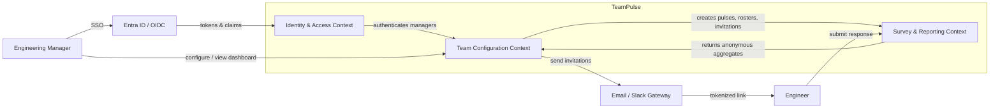
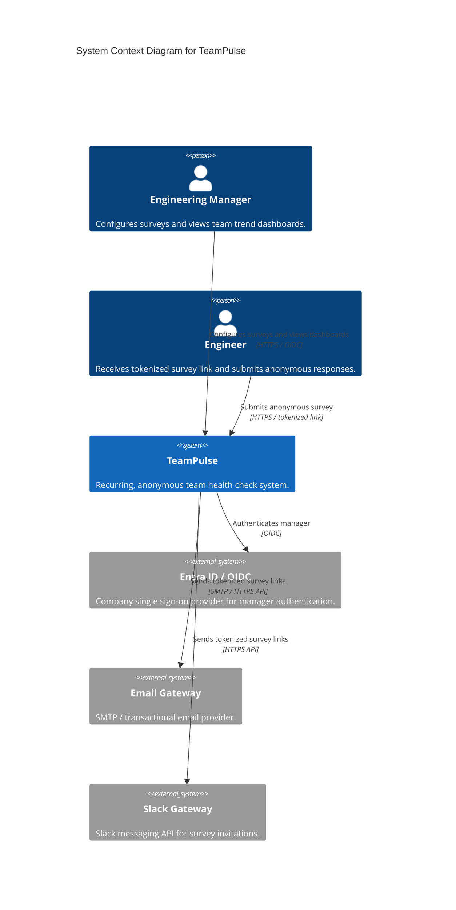
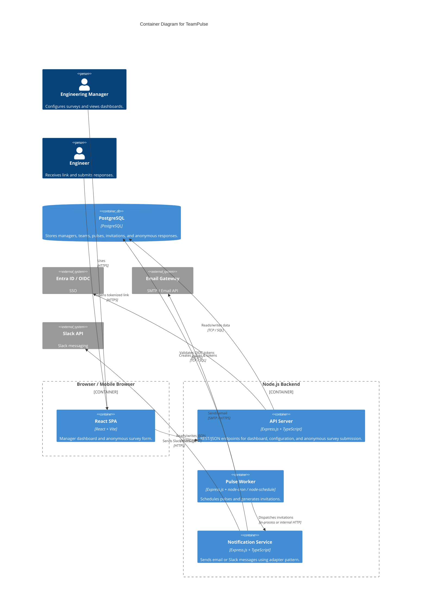
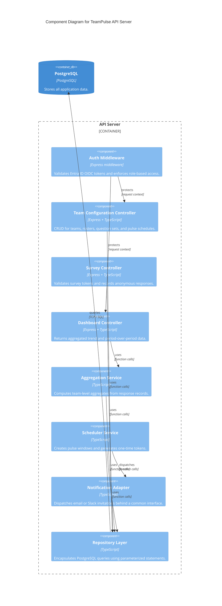
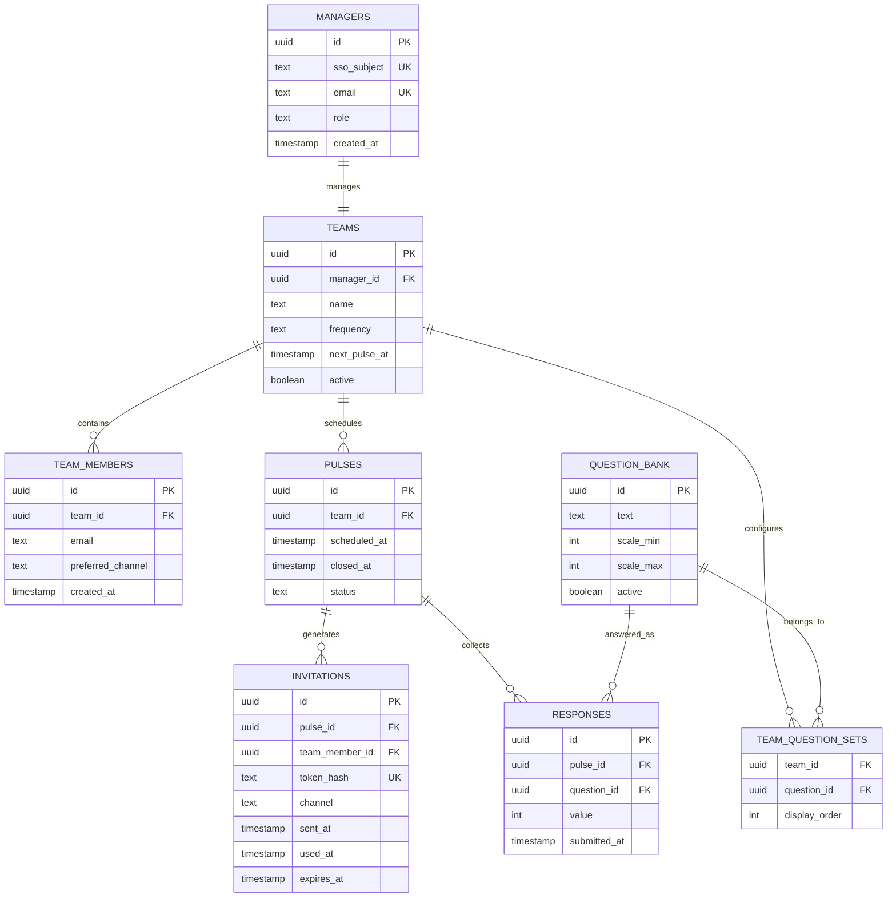
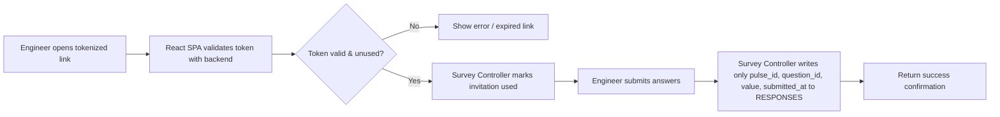
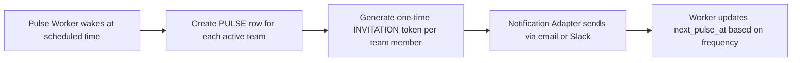
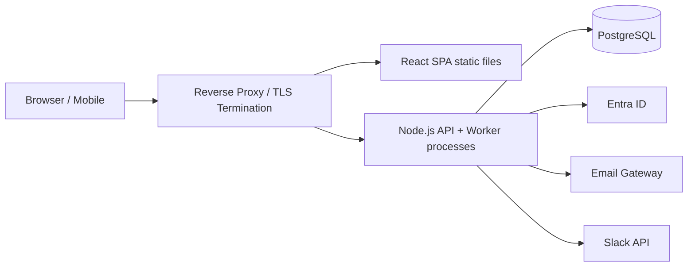

# TeamPulse Architecture Document

## 1. High-Level Architecture

TeamPulse is a web application built on the PERN stack: PostgreSQL for persistent storage, Express.js and Node.js for the backend API and job scheduling, and React (bundled with Vite) for the frontend. The system is split into two primary interfaces: a manager dashboard protected by Entra ID / OIDC, and an anonymous, tokenized survey form that does not require login. A lightweight job scheduler inside the Node.js backend triggers pulses and dispatches invitations. Aggregated trend data is computed in the backend and exposed through the dashboard API.

## 2. System Context Map

The Domain-Driven Design (DDD) context map identifies three bounded contexts. The boundaries below keep survey response data anonymous and isolated from team configuration and identity data.

### Bounded Contexts

| Context | Responsibility | Data Ownership |
|---------|----------------|----------------|
| Identity & Access | OIDC session validation, manager identity, role claims | SSO `sub`, `email`, `name`, `role` |
| Team Configuration | Manager profile, team roster, question set, pulse schedule, invitation delivery | `teams`, `team_members`, `question_bank`, `pulses`, `invitations` |
| Survey & Reporting | Anonymous response ingestion, aggregation, trend dashboard query | `responses`, aggregated views only |

## 3. System Breakdown (C4 Modeling)

### 3.1 System Context Diagram

### 3.2 Container Diagram

### 3.3 Component Diagram — API Server

## 4. Conceptual Database Design

### 4.1 Entity-Relationship Diagram

### 4.2 Anonymity Rule

The `RESPONSES` table has no foreign key or column that identifies an individual. It does not reference `invitations`, `team_members`, `managers`, or any SSO claim. This guarantees that a response record cannot be attributed to a person through the schema alone.

### 4.3 Data Flow Diagram — Survey Submission

### 4.4 Data Flow Diagram — Pulse Scheduling

## 5. Integrations

### 5.1 API Interface Overview

| Endpoint | Method | Auth | Description |
|----------|--------|------|-------------|
| `/auth/oidc/callback` | `GET` / `POST` | OIDC only | Handles Entra ID callback and establishes manager session. |
| `/api/teams` | `GET/POST/PUT/DELETE` | Manager | Manage team configuration and roster. |
| `/api/teams/:id/questions` | `GET/PUT` | Manager | Select 5–7 questions and ordering. |
| `/api/teams/:id/dashboard` | `GET` | Manager | Returns aggregated trend and period-over-period data for the manager's team. |
| `/api/pulses/:id/close` | `POST` | Manager or system | Closes a pulse and triggers aggregation refresh. |
| `/api/survey/:token` | `GET` | Token | Returns survey questions for the token's pulse. |
| `/api/survey/:token` | `POST` | Token | Submits anonymous responses. |
| `/health` | `GET` | None | Synthetic health check for uptime monitoring. |

All endpoints require HTTPS in production. Manager endpoints must present a valid Entra ID OIDC `id_token` or access token in the `Authorization` header. Anonymous survey endpoints accept only the single-use application token in the URL path.

### 5.2 External Integration Patterns

| External System | Pattern | Notes |
|-----------------|---------|-------|
| Entra ID / OIDC | OpenID Connect `authorization_code` flow or token validation | The backend validates tokens and extracts `sub` and `email` claims. No local password storage. |
| Email Gateway | SMTP or HTTPS API adapter | The `Notification Service` uses a common interface with an `EmailAdapter` implementation. |
| Slack Gateway | HTTPS REST API adapter | A `SlackAdapter` implementation can be swapped in without changing pulse or survey logic. |

**Adapter Pattern**: Both notification channels implement a single `Notifier` interface (e.g., `send(invitation: Invitation): Promise<void>`). Adding a new channel requires a new adapter, not changes to the scheduler or survey core.

## 6. Security Considerations

| Threat | Mitigation |
|--------|------------|
| Unauthorized dashboard access | All manager routes require valid Entra ID OIDC tokens. Backend re-evaluates `sub` / `email` against the `managers` table for every request. |
| Cross-team data leakage | Dashboard queries are filtered by `manager_id` or `team_id` derived from the authenticated manager. No endpoint accepts a `team_id` parameter from the client. |
| Individual response attribution | `RESPONSES` table has no user identifier columns and no FK to `invitations` or `team_members`. Aggregates are computed in SQL, not in the client. |
| Token replay | Invitation tokens are one-time; the backend checks `used_at IS NULL` before accepting a submission. Token hashes are stored, not plain tokens. |
| Token brute force / enumeration | Tokens are cryptographically random strings (≥128 bits). They expire after 7 days or at the next pulse, whichever is earlier. |
| Injection attacks | All database access uses parameterized queries / prepared statements. |
| Transit security | TLS 1.2+ for all browser, API, and integration traffic. |
| Session security | Manager sessions use short-lived OIDC tokens; refresh is delegated to Entra ID. |

## 7. Quality Attributes

| Quality Attribute | How It Is Addressed |
|-------------------|---------------------|
| **Performance** | The survey form is a lightweight React SPA. API responses are paginated; dashboard aggregates are pre-computed on pulse close. |
| **Reliability** | Stateless API servers behind a reverse proxy can be restarted without losing in-flight survey submissions. PostgreSQL is the single source of truth. |
| **Availability** | Health endpoint and synthetic monitoring support 99.9% uptime during pulse windows. The pulse worker can run as a separate process for resilience. |
| **Scalability** | Backend is stateless; additional Node.js instances can be added. Database read load for dashboards can be reduced with materialized aggregate tables if needed. |
| **Maintainability** | Clear bounded contexts, repository pattern, and adapter-based notification service isolate changes and enable unit testing with Jest (backend) and Vitest (frontend). |
| **Extensibility** | New notification channels or question types are added by implementing new adapters or question schemas without changing response storage. |
| **Security** | OIDC for authentication, team-level authorization, anonymous response schema, and one-time tokens. |

## 8. Deployment View

The React frontend is built with Vite into static assets served by a reverse proxy or static host. The Node.js backend runs one or more stateless processes: one or more API server processes and at least one pulse worker process. PostgreSQL runs as a managed or self-hosted service. The deployment topology does not depend on a specific cloud provider; any environment that can run Node.js, serve static files, and connect to PostgreSQL is acceptable.

## 9. Architecture Decisions and Trade-offs

| Decision | Rationale | Trade-off |
|----------|-----------|-----------|
| **PERN stack** | Matches the mandated tech stack and the team's skill set. | Vendor-agnostic but requires self-managed build and deployment tooling. |
| **Separate anonymous `RESPONSES` table** | Enforces anonymity at the database level and prevents accidental attribution in views or exports. | Debugging response issues is harder because there is no link back to invitations. |
| **One-time tokenized links, no engineer login** | Simplifies UX and avoids storing engineer credentials or sessions. | Lost invitations cannot be recovered without re-issuing a token. |
| **Pulse worker inside Node.js** | Reduces operational complexity for V1. | At scale, a dedicated job queue may be needed. |
| **Adapter pattern for notifications** | Allows email in V1 and Slack to be added without changing core logic. | Slightly more abstraction than a direct SMTP call. |
| **Aggregates computed on demand / at pulse close** | Keeps dashboard reads simple and consistent. | Large teams may require a periodic aggregate refresh strategy. |

## 10. Open Architecture Questions

1. Should the manager authenticate through a server-side session or a pure SPA implicit / PKCE OIDC flow?
2. How should invitation tokens be delivered if both email and Slack are configured for the same engineer?
3. Should expired invitation tokens be retained for audit, or deleted after the pulse closes?
4. Where should the pulse worker run — as a background process in the API container, as a separate container, or via an external cron service?
5. What is the disaster-recovery target for PostgreSQL (point-in-time recovery window, backup frequency)?
